### **Tutorial: Explotación de la máquina Anthem – TryHackMe**

Este laboratorio muestra el proceso de reconocimiento, enumeración, acceso inicial y escalada de privilegios en una máquina vulnerable del laboratorio de TryHackMe.

## 1. Conexión a la VPN de TryHackMe

Para acceder a las máquinas del laboratorio es necesario conectarse previamente a la VPN de TryHackMe. Esto crea un túnel seguro entre la máquina Kali Linux y la red privada donde se encuentran los sistemas vulnerables.

### 1.1 Conexión mediante OpenVPN

Desde la terminal de Kali se ejecuta el siguiente comando utilizando el archivo .ovpn descargado desde la plataforma:

```bash
sudo openvpn /home/nerea/Descargas/eu-central-1-nereacandonramos-regular.ovpn
```

Si la conexión se establece correctamente aparecerá el siguiente mensaje:

```bash
Initialization Sequence Completed
```

Esto indica que la conexión VPN se ha realizado correctamente.
Si vemos que no funciona, probar otro archivo de configuración hasta que se vea conectado en vez de central, poner west..


### 1.2 Verificación de la conexión

Para comprobar que la conexión está activa se ejecuta:

```bash
ip a
```

En la salida aparecerá una interfaz de red llamada:

```bash
tun0
```

Esta interfaz corresponde a la conexión con la red privada de TryHackMe.
Esta máquina no responde a ping, tarda en arrancar.

## 2. Escaneo de puertos con Nmap

El siguiente paso consiste en identificar los servicios expuestos en la máquina objetivo mediante un escaneo completo de puertos.

```bash
 nmap -sC -sV -Pn 10.130.172.154
 ```
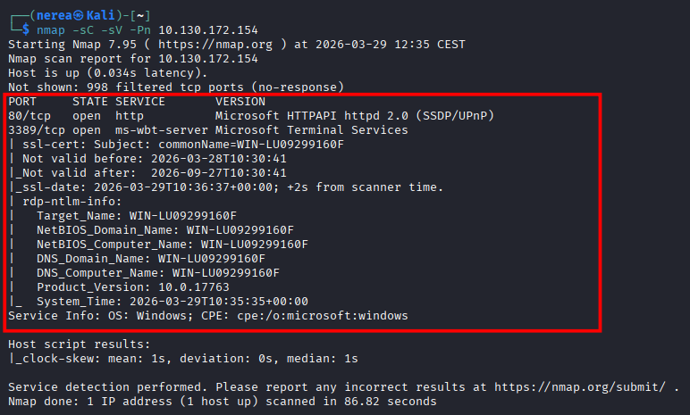


## 3. Acceder al puerto 80 con la ip de la máquina en el navegador.

En el puerto 80 nos encontramos una página web con el nombre de la maquina y un texto.

```bash
http://10.130.172.154
```
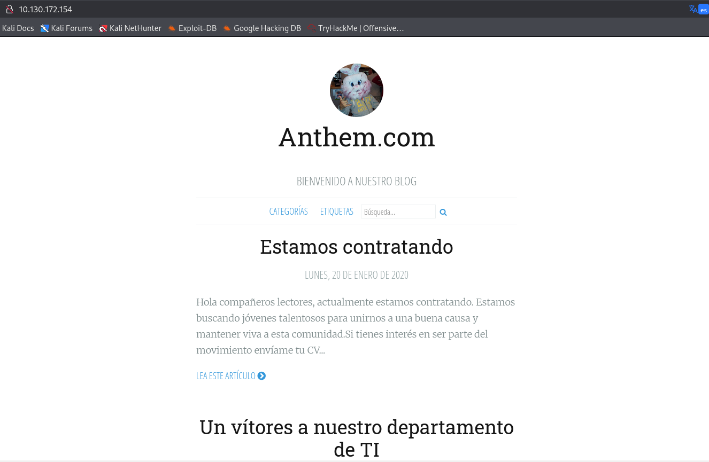

 
 ## 4. Enumeración de directorios

Para descubrir rutas ocultas, utilizamos Gobuster:

```bash
gobuster dir -u http://10.130.172.154 -w /usr/share/wordlists/dirb/common.txt
```
Esto permite encontrar directorios interesantes como:

```bash
/archive              (Status: 301) [Size: 118] [--> /]
/Archive              (Status: 301) [Size: 118] [--> /]
/authors              (Status: 200) [Size: 4080]
/blog                 (Status: 200) [Size: 5404]
/Blog                 (Status: 200) [Size: 5404]
/categories           (Status: 200) [Size: 3551]
/install              (Status: 302) [Size: 126] [--> /umbraco/]
/robots.txt           (Status: 200) [Size: 192]
/RSS                  (Status: 200) [Size: 1881]
/rss                  (Status: 200) [Size: 1881]
/search               (Status: 200) [Size: 3476]
/Search               (Status: 200) [Size: 3476]
/sitemap              (Status: 200) [Size: 1053]
/SiteMap              (Status: 200) [Size: 1053]
/tags                 (Status: 200) [Size: 3604]
```

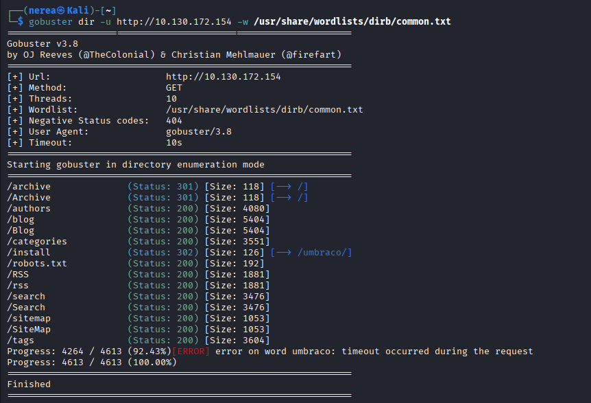

### 4.1 Archivo robots.txt

Se encuentra el archivo robots.txt, se accede desde el navegador:

```bash
http://10.130.172.154/robots.txt
```
Este archivo contiene rutas ocultas que el administrador no quiere que sean indexadas.
Encontramos una ruta interesante que es /umbraco/ y una supuesta contraseña que es UmbracoIsTheBest!
Vamos a inspeccionar la página web de nuevo haber si vemos información.

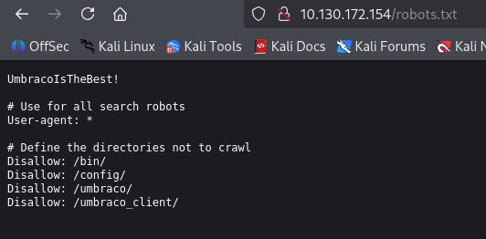


```bash
http://10.130.172.154
```

### 4.2 Web de Anthem

Observando la web vemos un comentario que nos llama la atención un usuario que nos da su correo.

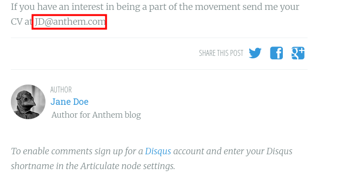

Mirando otro artículo de la web, un usuario nos dice que el administrador se dedica a escribir poemas y nos coloca uno de los poemas.
Los buscamos en google y aparece un nombre que es el administrador que buscamos.

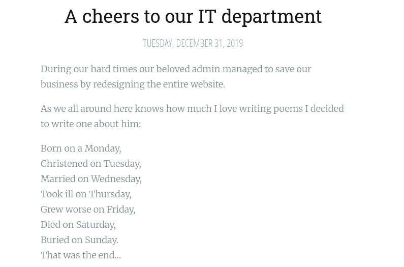

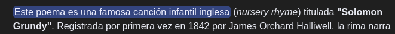

El nombre de nuestro Administrador es Solomon Grundy.

Las posibilidades de usuario puede ser:

- SG
- SG@anthem.com
- Solomon Grundy

## 5. Acceso al panel de administración

Vamos a la ruta /umbraco/ y nos encontramos con un login.

```bash
http://10.130.172.154/umbraco/
```

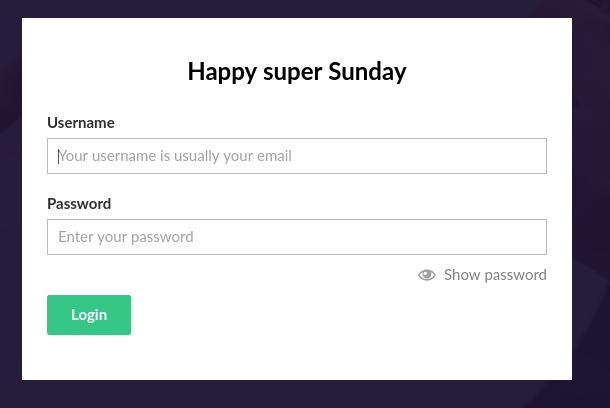

 Recordamos que cuando fuimos a robots, nos encontramos una contraseña y el nombre del administrador, vamos a probar a acceder con este usuario y contraseña:

 - Usuario: SG@anthem.com
 - Contraseña: UmbracoIsTheBest!

Este fue el acertado para entrar.

Accedemos al perfil del Administrador donde podemos ver todo los permisos que tiene y todo lo de la página, pero no puedo hacer nada para escalar privilegios.

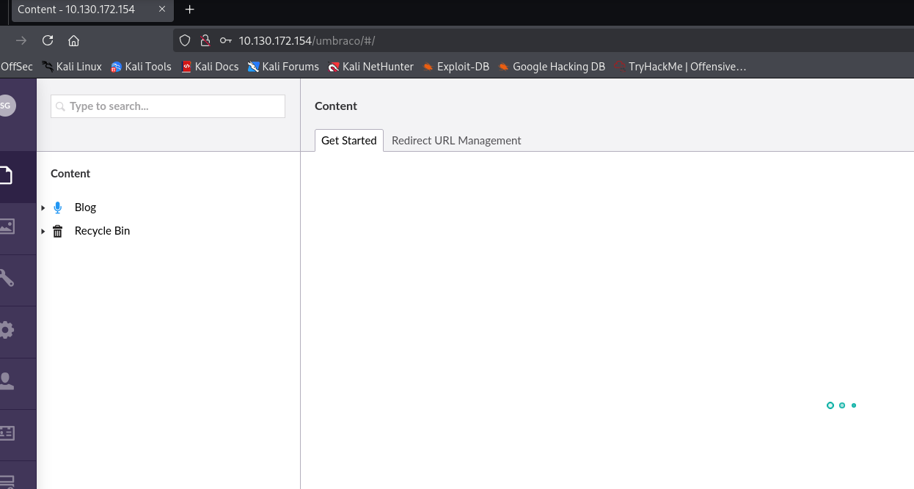


##  6. Acceso mediante RDP

Dado que en el escaneo inicial se detectó el puerto 3389 (RDP) abierto, se intenta reutilizar las credenciales obtenidas anteriormente.
Usaremos remmmina para acceder.

 - Usuario: SG
 - Contraseña: UmbracoIsTheBest!

```bash
remmina
```
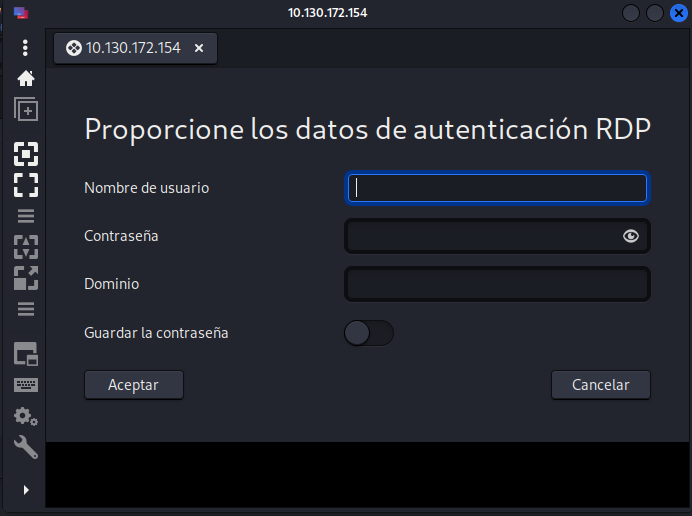

Este fue el acertado para entrar. En esta no me sirvió el otro usuario, use otra de las opciones que tenía.
Estamos dentro del ordenador y ya podemos empezar a escalar.

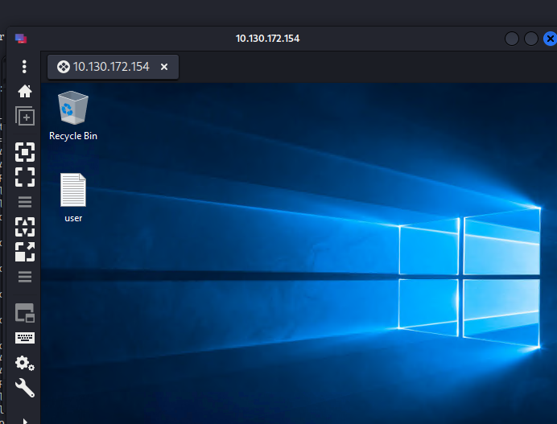


 ##  7. Observar que usuario somos

Miramos en el ordenador remoto en la cmd, el usuario que somos ahora mismo sin escalar privilegios aún.

```bash
whoami
```

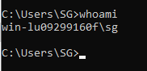

## 8. Búsqueda de información en el ordenador.

Empiezo a buscar en el ordenador de la victima todas las carpetas que tiene, encontramos el disco duro y dentro hay varias carpetas, me pongo a mirar las opciones de vista y observo que elemementos ocultos esta desactivado, asi que lo activo y aparece una carpeta que antes no estaba.

Carpetas a simple vista.

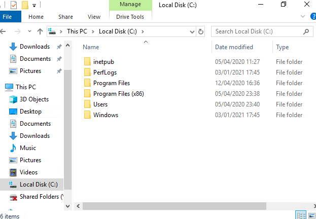

Carpeta oculta.

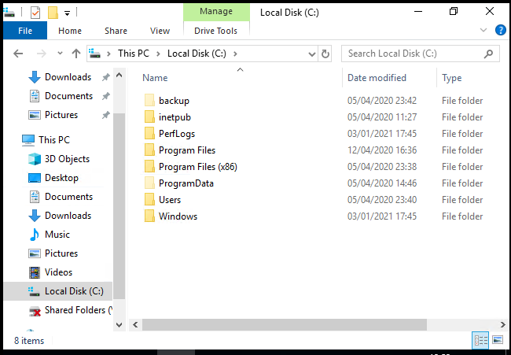

Dentro de la carpeta backups, hay un archivo llamado restore.txt e intento entrar pero me dice que no tengo permisos para abrirlos.

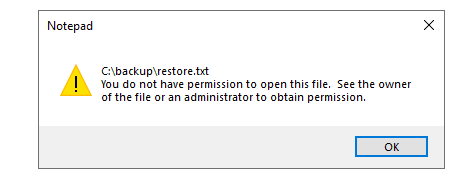


## 9. Modificar permisos

Dado que no es posible acceder al archivo restore.txt debido a restricciones de permisos, se procede a intentar modificar dichos permisos desde las propiedades del archivo.

Para ello:

- Se hace clic derecho sobre el archivo restore.txt
- Se accede a Propiedades
- Se selecciona la pestaña Seguridad
- Se editan los permisos del usuario actual  y escribimos SG y lo añadimos

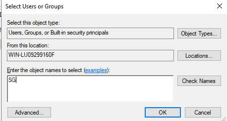

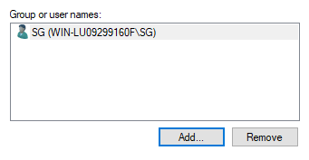

En este caso, se observa que el usuario tiene permisos suficientes para leer el contenido del archivo, por lo que se habilita el acceso.


## 10. Obtención de credenciales

Una vez se consiguen los permisos necesarios para acceder al archivo restore.txt, se procede a abrirlo.

Dentro del archivo se encuentra la siguiente información:

```bash
ChangeMeBaby1MoreTime
```
Este valor tiene toda la pinta de ser una contraseña en texto plano, almacenada de forma insegura en un archivo de copia de seguridad.

Buscamos powerShell y la cmd y le doy a ejecutar como administrador, me pide una contraseña y uso la que encontré y accedo, soy administrador pero no soy system.

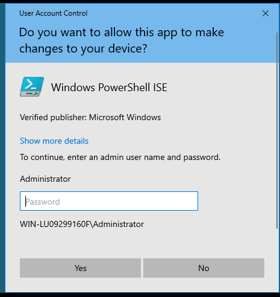

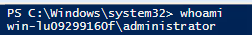

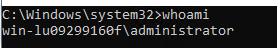


## 11. Escalada a SYSTEM

Una vez obtenido acceso como Administrador, el siguiente objetivo es alcanzar el nivel máximo de privilegios en el sistema (NT AUTHORITY\SYSTEM).

Para ello, se aprovechan las capacidades del usuario administrador para ejecutar procesos con mayores privilegios mediante el uso del Programador de tareas de Windows.

Se crea una tarea programada que ejecuta un comando bajo el contexto del usuario SYSTEM:

```bash
schtasks /create /tn sys_shell /tr "cmd.exe /c whoami > C:\Windows\Temp\sys.txt" /sc once /st 23:59 /ru SYSTEM
```

Una vez creada la tarea, se ejecuta manualmente:

```bash
schtasks /run /tn sys_shell
```

## 12. Verificación de privilegios

Para comprobar si la ejecución se ha realizado correctamente, se accede al archivo generado:

```bash
type C:\Windows\Temp\sys.txt
```

El resultado obtenido es:

```bash
nt authority\system
```

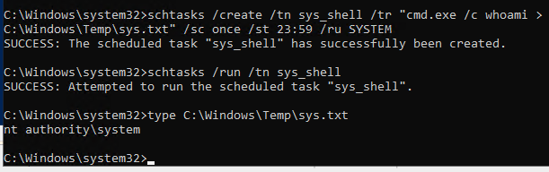

Esto confirma que el proceso se ha ejecutado con privilegios SYSTEM, el nivel más alto dentro del sistema operativo.