### **Tutorial: Explotación de la máquina Blaster – TryHackMe**

Este laboratorio demuestra el proceso completo de explotación de una máquina vulnerable utilizando Kali Linux, Nmap y Metasploit, incluyendo obtención de acceso inicial y escalada de privilegios.

## 1. Conexión a la VPN de TryHackMe

Para poder acceder a las máquinas del laboratorio es necesario conectarse primero a la VPN de TryHackMe.
Esto crea un túnel cifrado entre la máquina Kali y la red privada del laboratorio.

### 1.1 Conexión mediante OpenVPN

Desde la terminal de Kali se ejecuta el siguiente comando utilizando el archivo .ovpn descargado desde la plataforma:

```bash
sudo openvpn /home/nerea/Descargas/eu-central-1-nereacandonramos-regular.ovpn
```

Si la conexión se establece correctamente aparecerá el siguiente mensaje:

```bash
Initialization Sequence Completed
```

Esto indica que la VPN se ha conectado correctamente.

### 1.2 Verificación de la conexión

Para comprobar que la interfaz de red VPN se ha creado correctamente ejecutamos:

```bash
ip a
```

Debería aparecer una interfaz llamada tun0, que es la utilizada para la conexión VPN.

## 2. Identificación de la máquina objetivo

Una vez conectados a la VPN, TryHackMe proporciona la dirección IP de la máquina vulnerable.

En este caso la máquina tiene la siguiente dirección:

```bash
10.113.134.75 
```

Esta IP pertenece a la red privada del laboratorio y solo es accesible a través de la VPN.

## 3. Escaneo de puertos con Nmap

El siguiente paso es identificar los servicios expuestos en la máquina objetivo.

```bash
nmap -sC -sV -Pn 10.113.152.239
```


Opciones utilizadas:

- sC ejecuta scripts básicos de detección.

- sV detecta versiones de servicios.

##  4. Enumeración del servidor web

Al acceder a la página web desde el navegador:

```bash
http://10.113.152.239
```

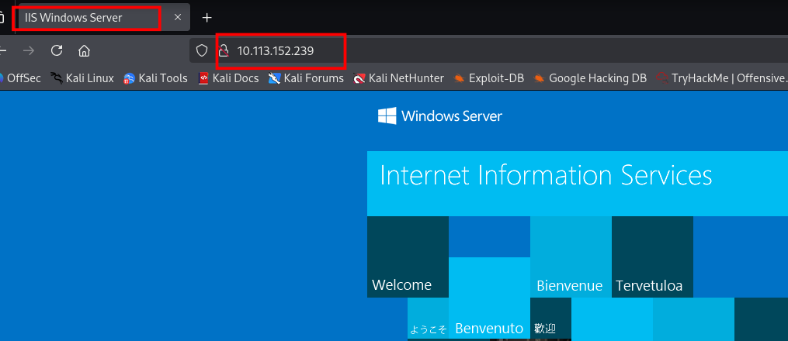

No se observa información relevante inicialmente, por lo que se realiza una búsqueda de directorios utilizando Gobuster.

```bash
gobuster dir -u http://10.113.152.239 -w /usr/share/dirb/wordlists/big.txt
```

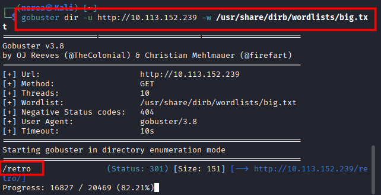

El resultado revela el siguiente directorio oculto:

```bash
/retro
```

## 5. Análisis del directorio /retro

Al acceder a:

```bash
http://10.113.152.239/retro
```
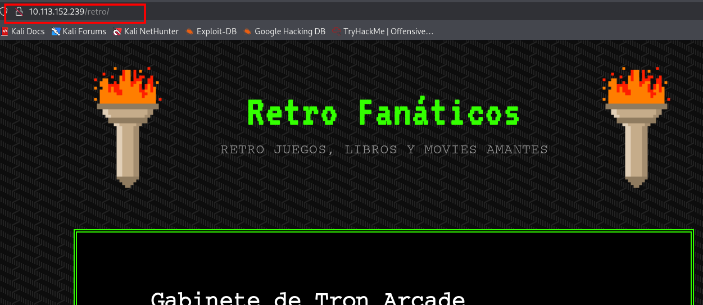

se observa un blog con varios comentarios de usuarios.

En uno de los comentarios aparece una pista interesante:

```bash
Wade
```


Dejándome una nota aquí por si olvido cómo deletarlo: parzival

Esto sugiere posibles credenciales:

Usuario:

```bash
wade
```
Contraseña:

```bash
parzival
```
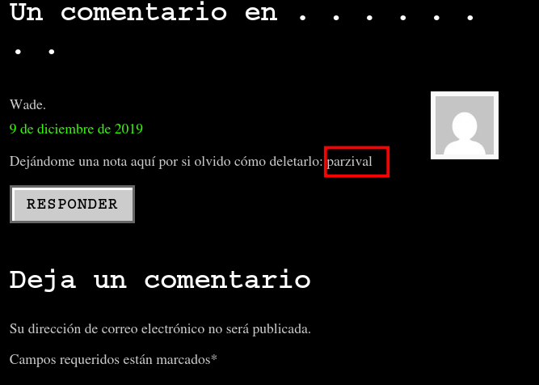

## 6. Acceso al sistema mediante RDP

La máquina tiene abierto el puerto 3389, correspondiente a Remote Desktop Protocol.

Desde Kali se puede acceder utilizando Remmina.

Primero se instala la herramienta:

```bash
sudo apt install remmina
```

Después se ejecuta:

```bash
remmina
```

Configuración de conexión:

- Protocolo: RDP

- IP: 10.113.152.239

- Usuario: wade

- Contraseña: parzival


Con estas credenciales se obtiene acceso al escritorio remoto de la máquina.

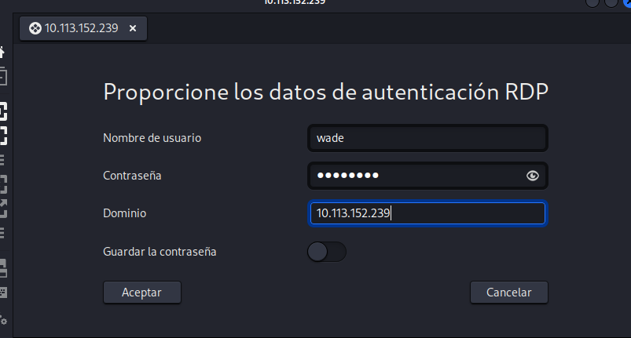

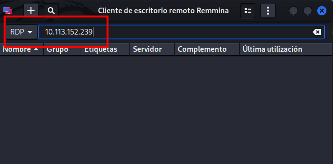


## 7. Enumeración del sistema

Una vez dentro del sistema se puede abrir una consola y ejecutar:

```bash
whoami
```

Resultado:

```bash
retroweb\wade
```

También se puede obtener información del sistema:

```bash
systeminfo
```

Esto permite conocer:

- versión de Windows

- arquitectura

- actualizaciones instaladas

- configuración del sistema

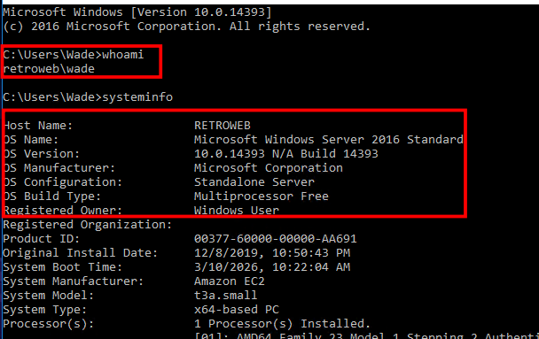

## 8. Escalada de privilegios

En el escritorio del usuario se encuentra el archivo ejecutable:

```bash
hhupd.exe
```
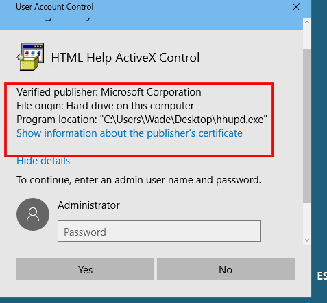

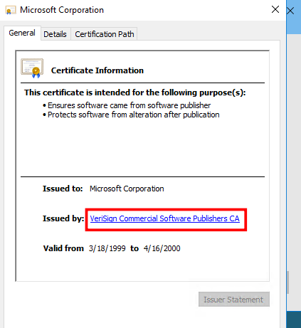

Al ejecutarlo aparece una ventana de User Account Control (UAC) solicitando privilegios de administrador.

El programa abre Internet Explorer.

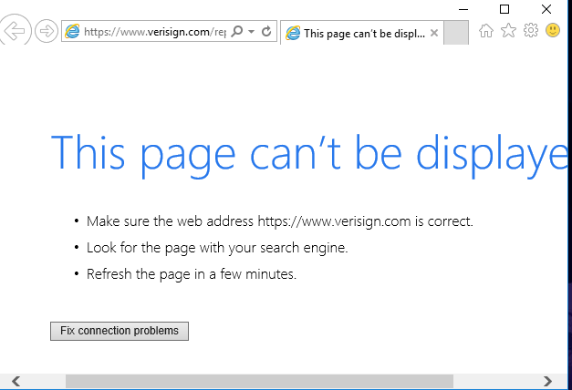


## 9. Bypass del UAC

Una vez abierto Internet Explorer se realiza el siguiente procedimiento:

1. Presionar

```bash
Ctrl + S
```

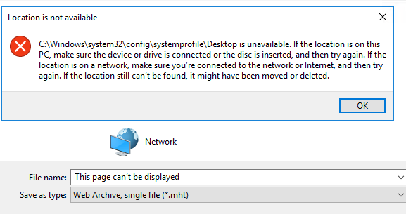

2. Se abre la ventana Guardar como.

3. En la barra de dirección escribir:

```bash
cmd
```

4. Presionar Enter.

Esto abre una consola cmd.exe con privilegios elevados.


## 10. Verificación de privilegios

En la consola ejecutamos:

```bash
whoami
```
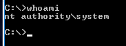

Si la escalada se ha realizado correctamente se obtienen privilegios administrativos del sistema.